# Introduction

`lda.chat` is an AI agent that turns natural language requests into executable
workspace workflows. The LLM plans a directed graph of typed steps. A
deterministic executor runs it. Registered node handlers do the real
work---whether those handlers call MCP tools, run local Python functions,
execute saved subworkflows, or compose authoring-layer operations.

The core architectural split:

> **The LLM plans, but does not execute. The executor executes, but does not
> think. Nodes do work. Edges are dumb routing.**

**Thesis scope** is narrow: prove the planner/executor/tool split end to end
with a few working MCP tools, LLM-generated workflow JSON, validated execution,
and structured results. The broader product vision---tool registries, scheduling,
multi-user---is out of scope.

# System Architecture \status{implemented}

## Package Structure

The system is organized into three main packages with strict dependency
boundaries.

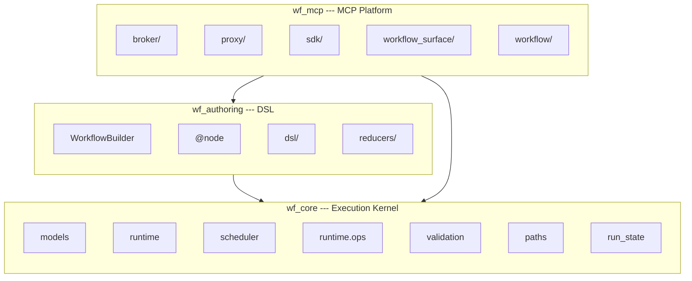

**Dependency rules:**

- `wf_core` must not import `wf_authoring` or `wf_mcp`.
- `wf_mcp.sdk` should not import `wf_core` or `wf_authoring`.
- `wf_mcp.proxy` should not import `wf_mcp.workflow`.
- `wf_mcp.workflow` is the only layer that converts MCP tools into node specs.

## Data Flow

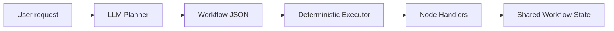

# Workflow Model \status{implemented}

A workflow is a directed graph with explicit schemas and explicit control flow.

## Top-Level Structure

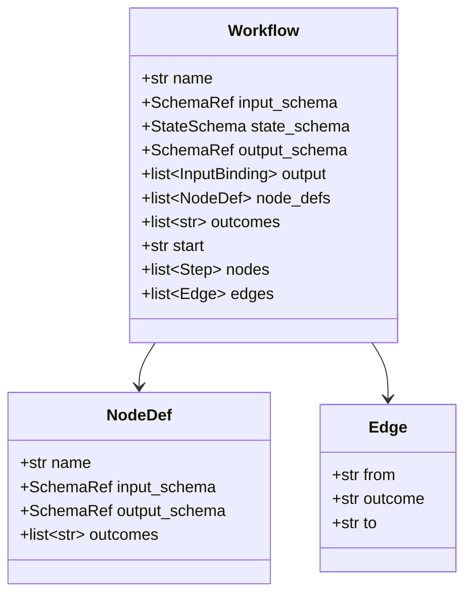

## Schema Boundaries

Three schemas define distinct contracts:

- **`input_schema`** validates run input once. Input is stored independently and
  remains readable throughout execution via `input.*` paths.
- **`state_schema`** defines typed workflow memory with per-field merge
  reducers. Nodes read/write state via `state.*` paths.
- **`output_schema`** declares the output contract. Output is projected via
  explicit `workflow.output` bindings that can read from `state.*`, `input.*`,
  or `context.*` paths. A legacy fallback derives output from same-name top-level
  state keys when bindings are omitted.

Input, state, and context are **separate read roots**. The runtime resolves
bindings against all three independently; input is not merged into state.

## Step Types

Steps form a discriminated union on the `type` field:

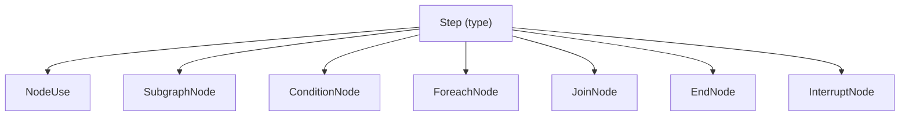

**NodeUse** binds a reusable `NodeDef` with explicit input/output path
bindings. **ConditionNode** evaluates structured JSON expressions (not code
strings). **ForeachNode** iterates serial or concurrent. **InterruptNode**
pauses for typed external input. **EndNode** sets non-`ok` workflow outcomes.

## Path Bindings

Bindings connect graph state to node-local payloads using structural paths:

```json
{
  "input": [
    { "target": { "root": "local", "parts": ["text"] },
      "path":   { "root": "input", "parts": ["text"] } }
  ],
  "output": [
    { "source": { "root": "local", "parts": ["echoed"] },
      "target": { "root": "state", "parts": ["echoed"] } }
  ]
}
```

Three path kinds: **LocalPath** (node payload), **GraphSourcePath**
(read from `input`/`state`/`context`), **StatePath** (write to state).

## State Reducers

State fields declare merge behavior. This matters for parallel and foreach
execution where multiple writers target the same path.

| Reducer | Policy | Use case |
|:--------|:-------|:---------|
| `wf.std.replace` | exclusive | Default scalars |
| `wf.std.append` | mergeable | Foreach accumulation |
| `wf.std.merge_object` | mergeable | Parallel object updates |
| `wf.std.add` | mergeable | Counters |
| `wf.std.set_union` | mergeable | Tag/ID collection |

# Runtime Execution \status{implemented}

## Execution Flow

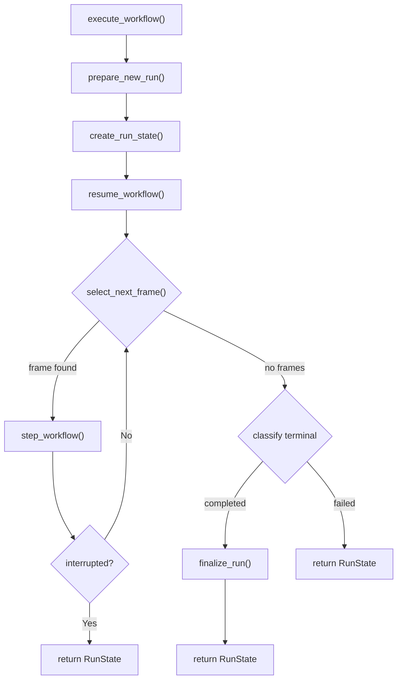

The executor loops: select a frame from the ready queue, dispatch one step,
re-enqueue or terminate. It never thinks. It only routes.

## Step Dispatch

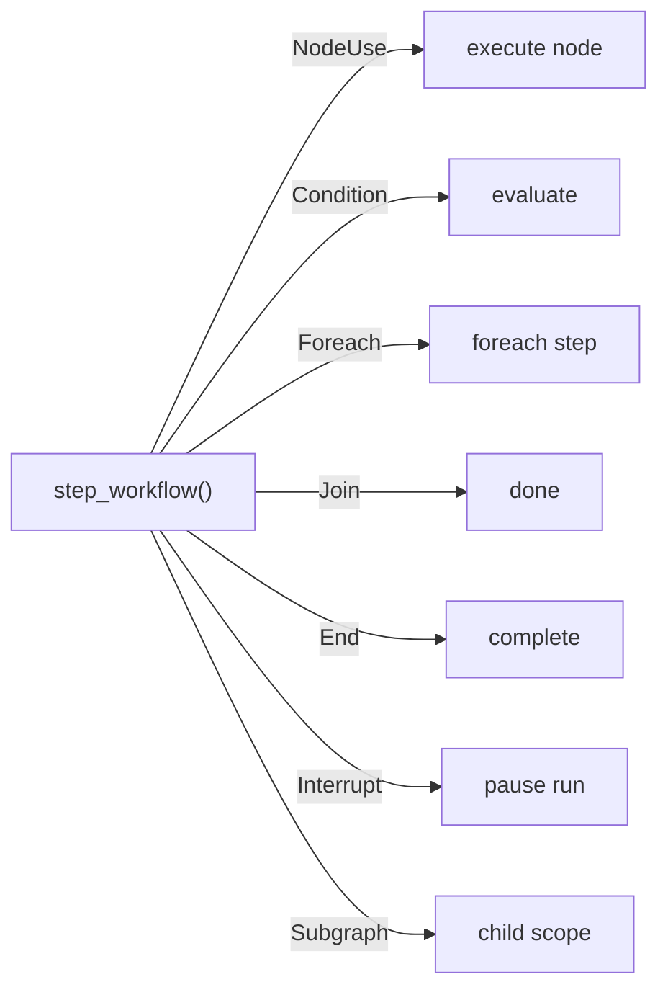

Node handlers are registered callables---anything from a thin MCP tool wrapper
to a full Python function. The executor does not distinguish handler origin; it
resolves by name from the registry, invokes, validates, and commits.

## Node Execution

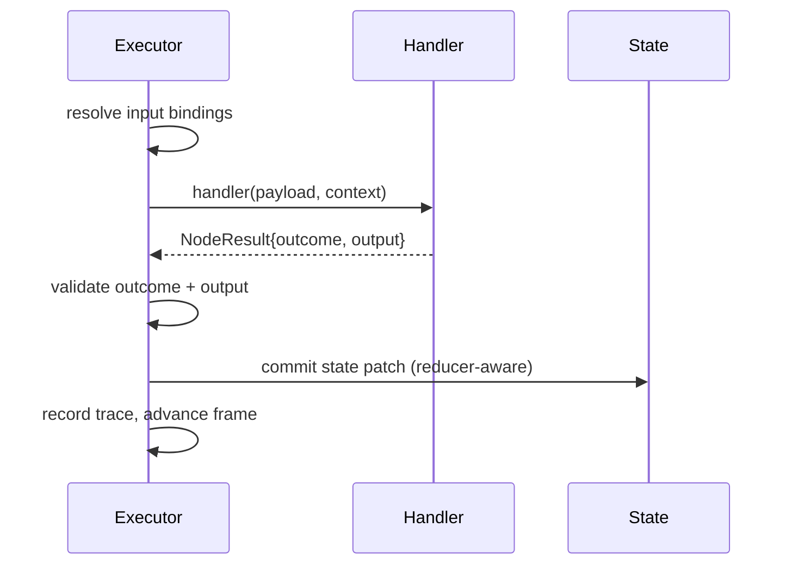

Two channels stay separate: **outcome** controls routing, **output** carries
typed business data.

## Scheduler

The scheduler uses an explicit FIFO **ready queue** of frame IDs.

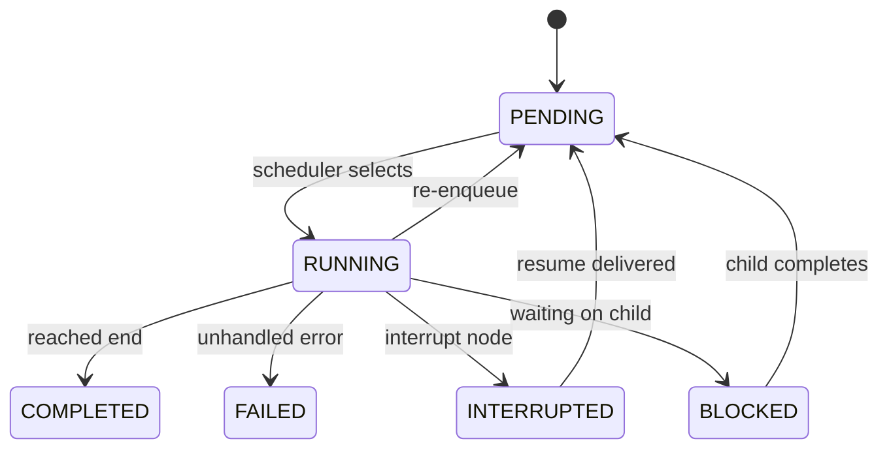

When the ready queue is empty, the scheduler classifies the run as completed,
interrupted, failed, or deadlocked.

# Foreach \status{implemented}

## Serial

Each iteration creates a child frame, blocks the parent, and runs to
completion before the next item starts.

## Concurrent

Multiple item frames run simultaneously. Each gets its own **lineage**---a
write overlay that isolates sibling state. At the barrier, patches commit in
item-index order through declared reducers.

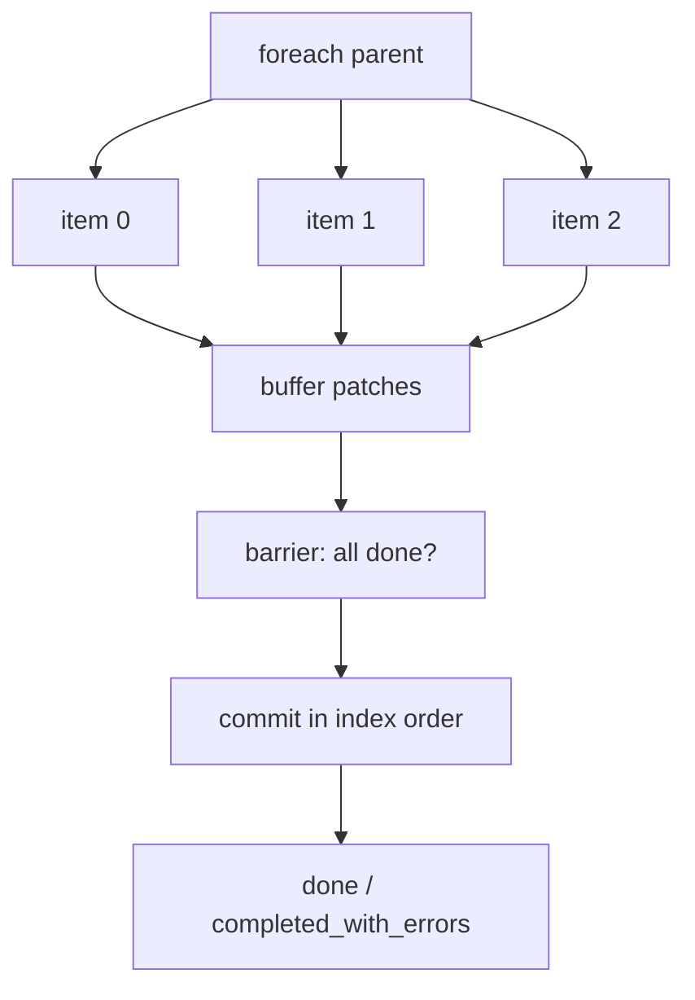

Capacity is bounded by `ForeachConcurrentPolicy`: `max_active` (default 4)
limits ready/running item frames; `max_outstanding` (default 20) limits
active + blocked. Item error policies: **fail** (stop), **skip** (continue,
no state), **collect** (continue, write structured error records).

# Interrupts \status{implemented}

Interrupts are graph-native and typed, not arbitrary line-level pauses.

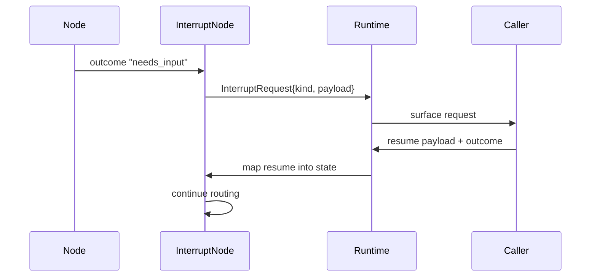

Pause points stay visible in the graph. Payloads are validated by `kind`.
Traces stay clean.

# Subgraph Composition \status{implemented}

A workflow can be used as a node, giving **graph composition** with one
consistent contract.

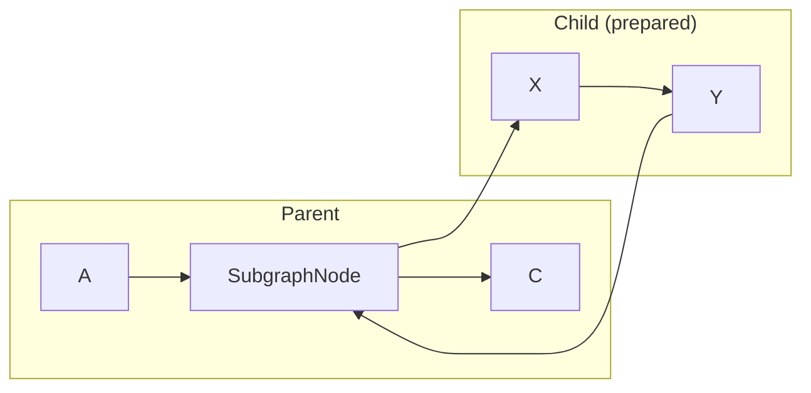

The parent supplies input bindings. The child runs in its own scope with its
own lineage. Output bindings project child state back to the parent.

**Interrupt bubbling (v1):** When a child subgraph hits an interrupt node, the
runtime constructs an `InterruptRoute` that identifies the child frame, scope,
and workflow ref. The parent subgraph frame stays `BLOCKED`; the entire run
returns `INTERRUPTED`. Resume restores the child scope and continues inside it.
This works for prepared local children. Artifact/deployment resolution for
nested saved children remains outside core; the platform resolves saved
descendants before execution starts.

# Authoring Layer \status{implemented}

## WorkflowBuilder

Fluent Python DSL for constructing workflows without raw dicts:

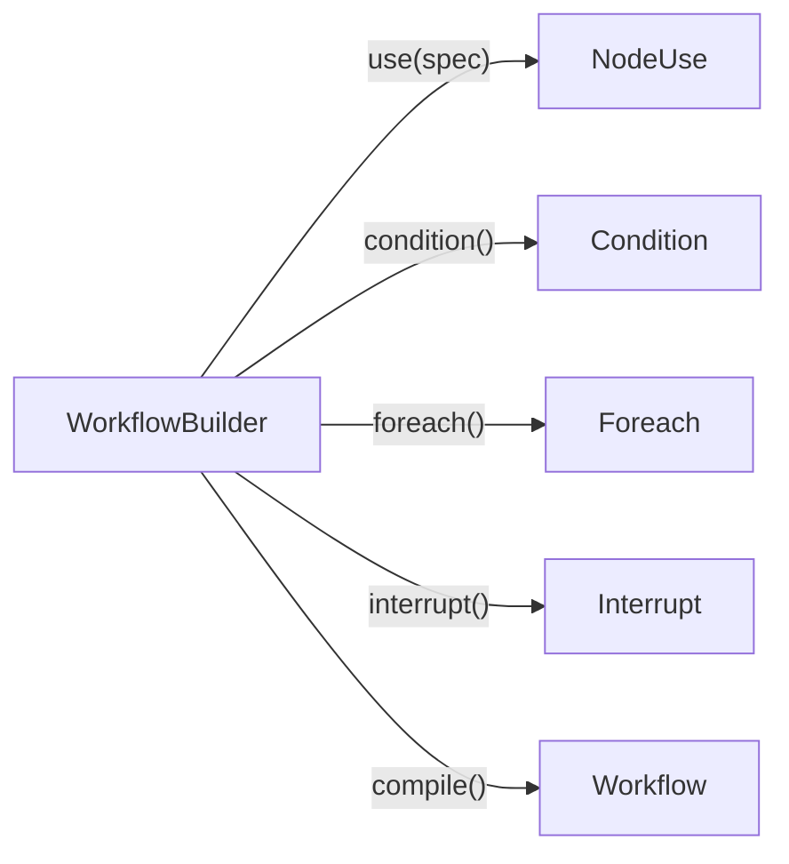

Common operations: `use(spec)`, `connect(from, outcome, to)`,
`branch(from, branches)`, `when(cond, then, otherwise)`,
`match(value, cases)`, `foreach(over, mode)`.

## @node Decorator

Converts a typed Python function into a reusable `NodeSpec`:

```python
@node(name="summarize", outcomes=["ok"])
def summarize_doc(input: SummarizeInput, ctx: RuntimeContext) -> SummarizeOutput:
    """Summarize a single document."""
    return SummarizeOutput(summary=input.text[:500])
```

The decorator infers input/output models from type annotations, detects async,
and generates the `NodeDef` with schema refs.

# MCP Platform \status{implemented}

## Architecture

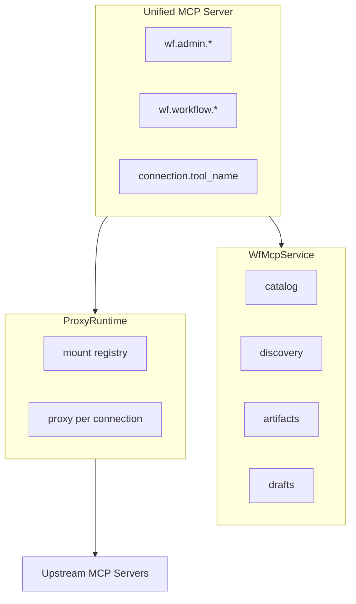

Each upstream connection gets a namespaced `FastMCPProxy` mount
(`connection_id.tool_name`). Hot reload is best-effort; FastMCP lacks a
complete unmount lifecycle.

## Tool Conversion

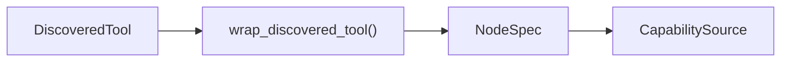

Every MCP tool gets `outcomes=("ok", "error")` by default. The wrapper
preserves the original JSON Schema as a contract and generates an async
handler that calls the upstream tool.

# Artifact Lifecycle \status{implemented}

## Draft to Deployment

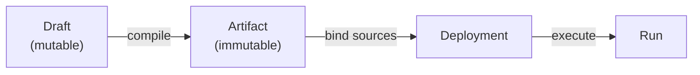

**Draft workspaces** support iterative LLM authoring with optimistic
concurrency (revision-checked patches). **Artifacts** are versioned snapshots
with dependency contract hashes. **Deployments** bind logical source aliases
to concrete MCP connections.

## Durable Runs \status{v1 boundaries}

Every `run_deployment` call persists a stopped run record (file-backed JSON)
with a stable `run_id`. Interrupted runs can be resumed via `resume_run` after
process restart, provided the same `FileRunStore` root is accessible.

**V1 limits:**

- Checkpointing happens at stopped boundaries only (interrupted, completed,
  failed). No per-node or mid-call crash recovery.
- Resume revalidates the pinned dependency environment. If a required source is
  missing or disabled, resume returns `resume_readiness=blocked` without
  consuming the payload.
- During live execution, source failures produce a `failed` run, not a
  `blocked` one. The `blocked` gate applies only at resume time.

Two deployments can point the same artifact at different accounts:

```
summarize_docs.personal -> context7.personal
summarize_docs.work     -> context7.work
```

# Validation \status{implemented}

## Structural (Pre-Execution)

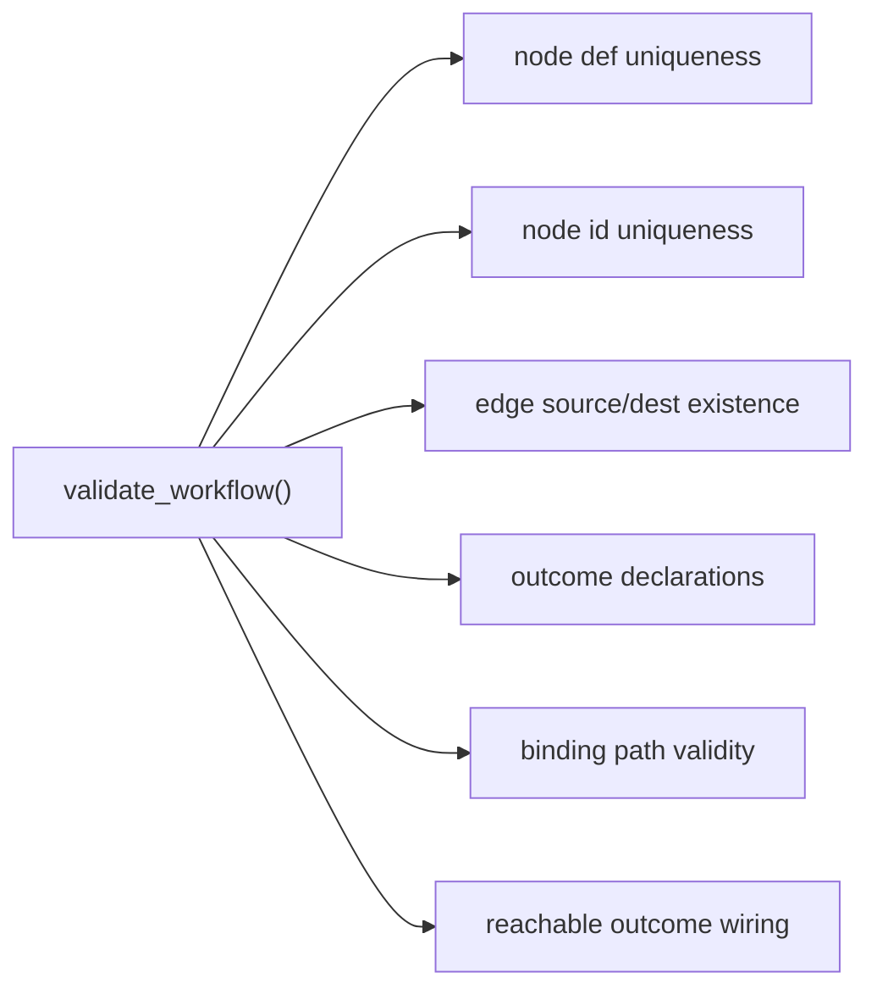

Reports multiple issues via `ValidationReport` instead of failing at the
first.

## Runtime

At runtime: outcome is declared, output matches schema, merge conflicts are
caught, final output validates against `output_schema`.

# Open Questions

- Should the legacy same-name top-level state output fallback be removed once
  explicit final output bindings are used everywhere?
- Trace model for raw extra node output?
- Isolated pure-Python execution: node type, tool backend, or separate API?
- Retry policy vs non-idempotent side-effecting tools?

# Stack

| Layer | Technology |
|:------|:-----------|
| Language | Python 3.14+ |
| Validation | Pydantic v2 |
| Tool protocol | MCP |
| MCP framework | FastMCP 3.2.4+ |
| Storage | File-backed JSON stores today; SQLite/PostgreSQL planned |

---

*Incomplete. See `docs/README.md` for the full documentation index.*
