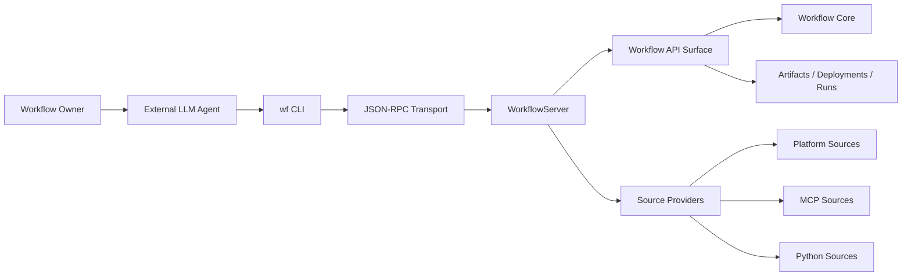
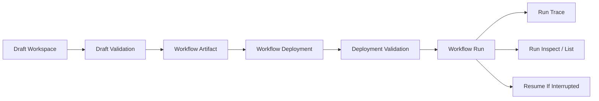
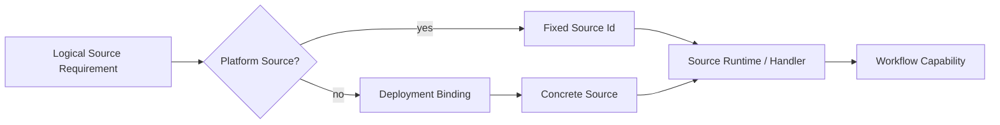

# Diagram Scratchpad

This file is a working library of Mermaid diagrams for the thesis/report. Keep
diagrams here while they are being shaped, then copy stable versions into the
final document when the surrounding prose is ready.

## Main Architecture Spine

## Workflow Lifecycle

## Source Resolution

