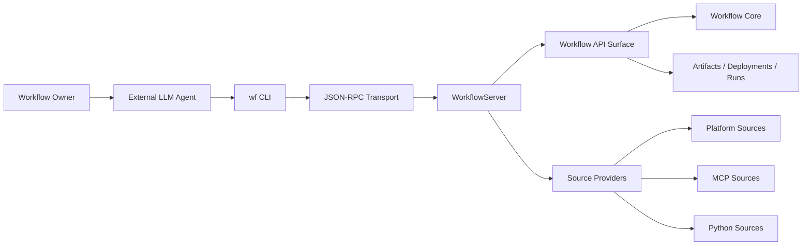
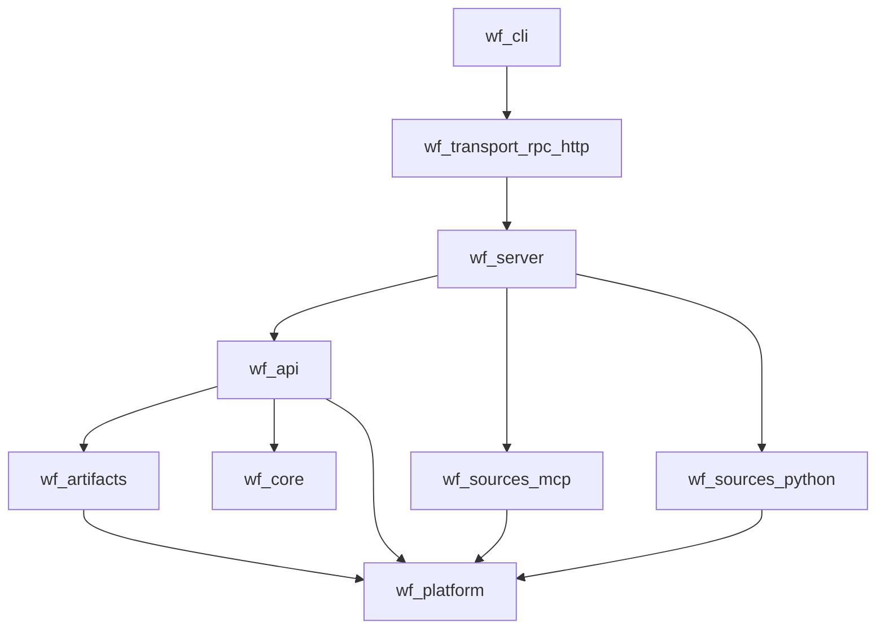
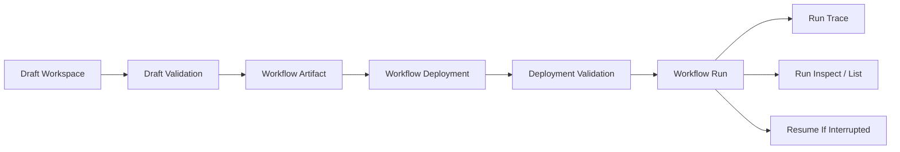
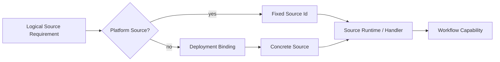
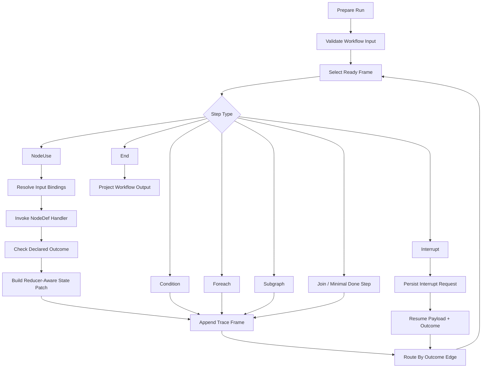
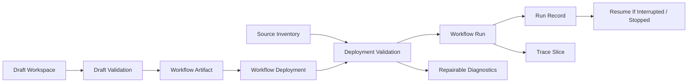
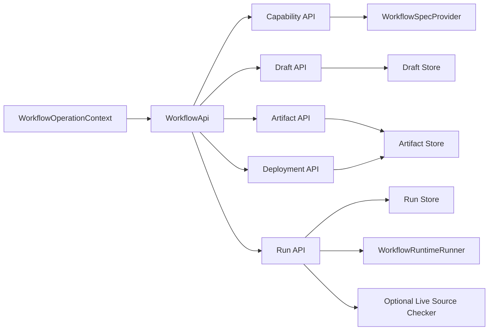
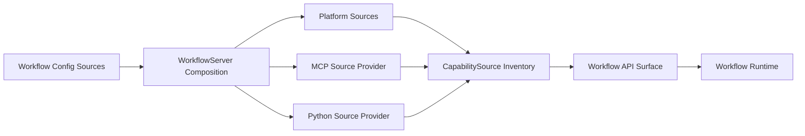

# Diagram Scratchpad

This file is a working library of Mermaid diagrams for the thesis/report. Keep
diagrams here while they are being shaped, then copy stable versions into the
final document when the surrounding prose is ready.

## Main Architecture Spine

## Layered Package Boundary

> Package ownership view, not a runtime call graph.

## Workflow Lifecycle

> Simplified view. For the detailed platform-domain version with source inventory
> and diagnostics, see "Platform Domain" below.

## Source Resolution

## Workflow Core

## Platform Domain

## Workflow API Lifecycle Cohesion

## Source Provider Boundary

