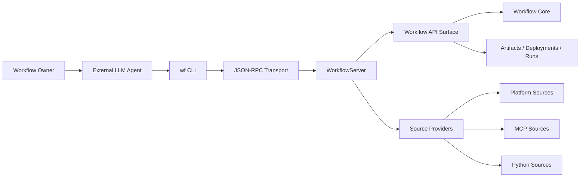
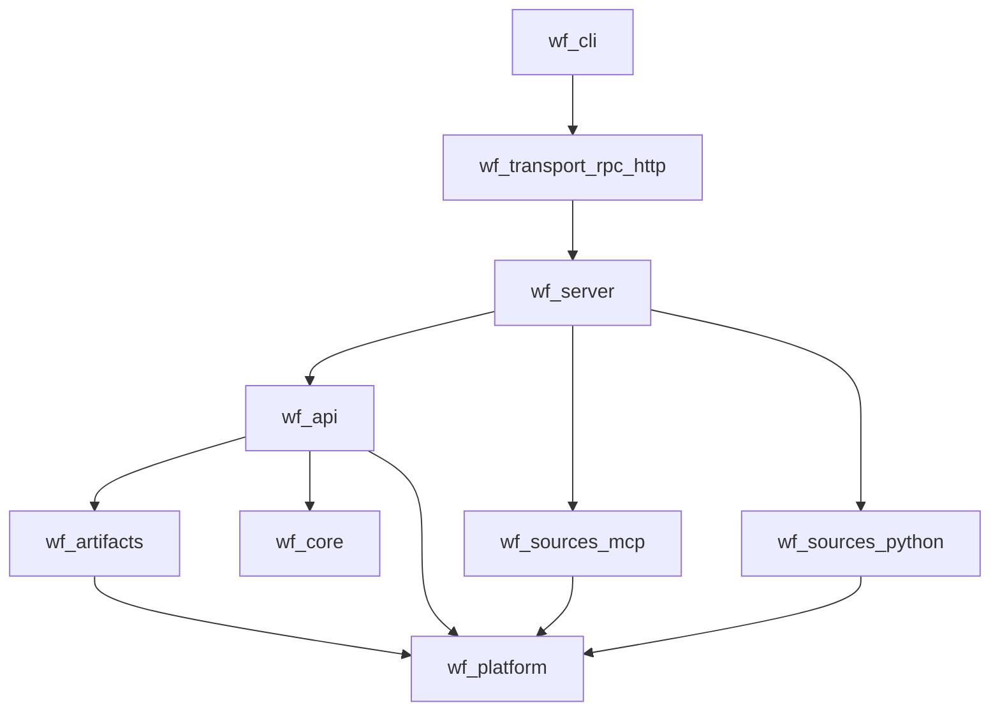
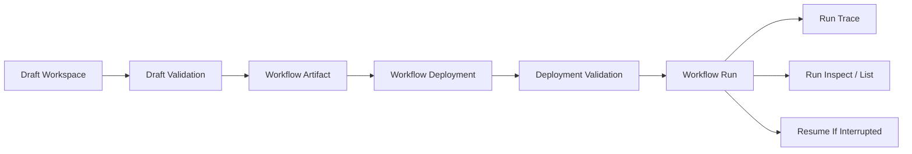
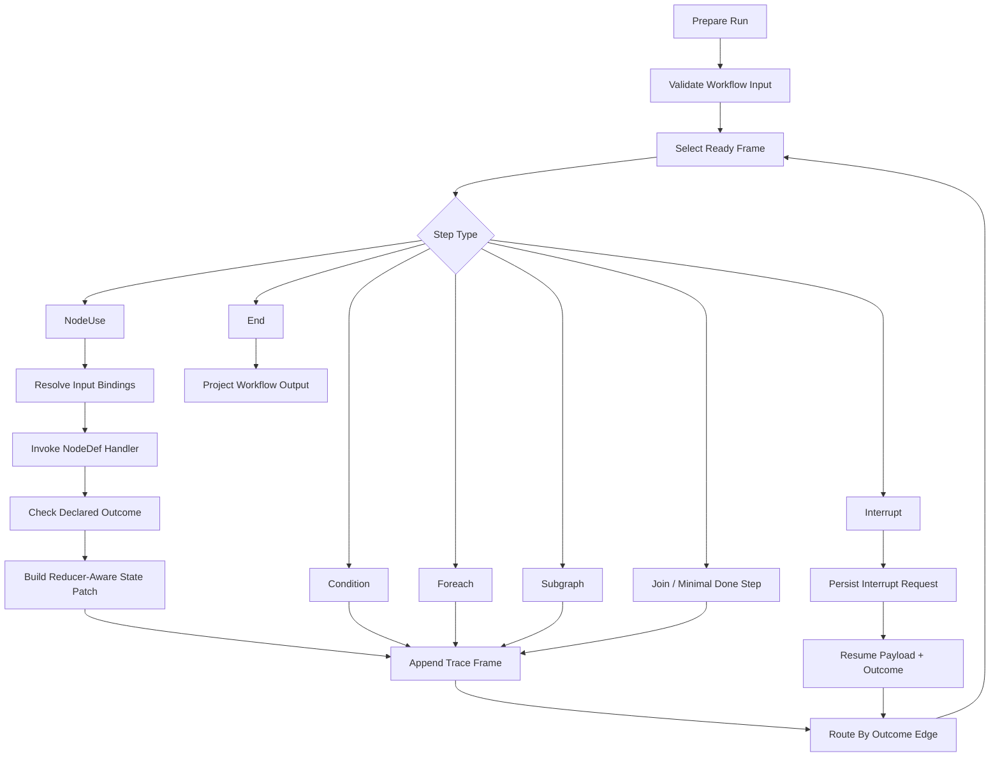
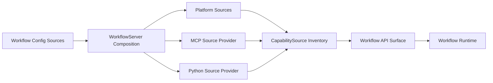
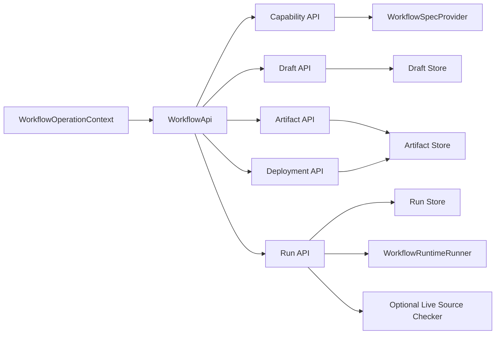
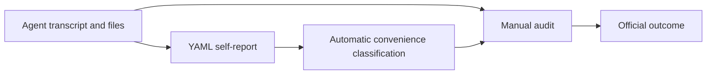

# Introduction

This report assumes a setting in which external LLM agents are used as workflow
authors and operators, and asks what platform substrate they need for reusable
workspace automation. It describes the design and implementation of `lda.chat`,
a prototype platform where agents can author, validate, execute, and inspect
reusable workspace workflows without making the LLM itself responsible for
runtime state, validation, source binding, or persistence.

The central claim is that agent-facing workflow automation should separate
planning from execution. The LLM or human author can propose and revise workflow
structure, while the platform owns artifacts, deployments, runs, source
inventory, validation diagnostics, traces, and resumability.

The research question guiding this work is: how can an AI-agent-facing workflow
platform represent, validate, execute, and persist reusable workspace
automations while keeping planning separate from deterministic execution?

The short version of the thesis is: the LLM plans; the runtime executes; source
providers expose capabilities; stores preserve persisted lifecycle records. The
implementation demonstrates this model across controlled built-in, MCP, and
Python source examples.

**Scope of claims.** This report does not claim production security, broad
external-agent evaluation, arbitrary mid-node crash recovery, scheduling,
role-based access control, general workflow parallelism, or a bundled autonomous
agent brain. Claims about planner efficiency are design hypotheses supported by
structured diagnostics and controlled examples, not measured retry-reduction
results.

## Report Outline

Section 2 frames the problem that motivates a separate execution substrate.
Section 3 positions the system against related approaches. Section 4 describes
the conceptual model of workflows, artifacts, deployments, runs, and source
bindings. Section 5 presents the system architecture and its layered boundaries.
Section 6 details the implementation of each layer. Section 7 walks through a
deterministic report-preparation case study backed by a Python source. Section 8
evaluates the implementation against concrete evidence. Sections 9 and 10
discuss limitations and future work. Section 11 concludes.

# Problem Statement And Requirements

A common pattern in agent systems lets an LLM orchestrate side effects
through sequential tool calls. ReAct-style prompting demonstrates interleaved
reasoning and action, while Toolformer-style work demonstrates learned external
API/tool use [@react-2022; @toolformer-2023].
The problem statement here is narrower: when a tool loop is used as a reusable
workspace automation substrate, several practical platform concerns appear.

- **Weak validation before execution.** A planner that assembles tool-call
  sequences often lacks a typed contract describing what each step expects and
  produces. Invalid plans reach the runtime and fail at execution time rather
  than during authoring. Structured-output work supports the design assumption
  that schema adherence can be treated as an API/runtime contract rather than
  left entirely to planner inference [@openai-structured-outputs-2024].

- **Poor resumability after interruption.** Raw tool-call loops do not
  checkpoint their progress. If the process restarts, the agent must reconstruct
  its prior state from scratch or lose work. Durable agent frameworks expose
  persistence/checkpoint layers specifically because continuation, failure
  recovery, and memory across interactions are runtime concerns
  [@langgraph-persistence-2026].

- **Hard-to-audit traces.** Successful tool-call chains leave logs, but the
  causal structure of a multi-step procedure is not separated from the transport
  or provider noise. Inspecting what happened, why a step failed, or what the
  intermediate state was requires manual log parsing. Recent
  agent-auditability and LLM-accountability work frames action recoverability,
  lifecycle coverage, and evidence integrity as explicit requirements
  [@auditable-agents-2026; @audit-trails-llm-2026].

- **Limited reuse.** A successful tool-call procedure is embedded in a
  conversation transcript or script. Extracting it into a named, versioned,
  redeployable artifact is manual work the agent is not equipped to perform
  reliably.

- **Unclear boundaries between planning, execution, and provider-specific
  state.** When an LLM is responsible for both deciding what to do and
  managing runtime state, auth tokens, session pools, or source catalogs, the
  two concerns become entangled. Provider drift, stale sessions, or auth
  failures become hard to diagnose.

The automation target for this platform is reusable workspace procedures, not
arbitrary office work end-to-end. Examples include document transformation, data
collection, tool and API calls, report preparation, and monitoring checks.
Scheduled execution is a future deployment mode, not implemented in this
prototype. The thesis frames the platform as a response to these pressures: a
typed execution substrate where persisted lifecycle records, validation, source
binding, and trace inspection are first-class platform concerns rather than
responsibilities of the planner.

The design requirements that follow from this problem statement are:

1. Typed workflow artifact, deployment, and run lifecycle with explicit schemas.
2. Source-provider boundary implemented for built-in, MCP, and Python sources,
   and designed to admit future source families that can be projected into the
   existing capability/source contract.
3. Server, API, and CLI surfaces that external agents can drive, backed by
   persisted lifecycle stores.
4. Validation and inspection mechanisms intended to reduce planner
   trial-and-error.
5. Next-action guidance that points an agent toward useful lifecycle operations
   without replacing validation.
6. Deterministic execution for the thesis-critical evidence path.

# Positioning And Related Systems

The system occupies a specific position in the automation landscape. It does
not attempt to replace mature platforms in their strengths, but rather explores
a different center of gravity: external AI agents can drive the authoring and
execution lifecycle directly through typed contracts. The comparison below is
qualitative positioning, not a benchmark across products.

## Direct LLM Tool Orchestration

Direct tool orchestration through an LLM is the most open-ended approach: the
planner can choose tools dynamically and adapt immediately. In this report's
framing, that flexibility becomes a problem when the tool loop is also expected
to provide persisted lifecycle records, validation, audit structure, and
resumability. The platform argues that reusable workspace automation benefits
from separating planning from a typed execution substrate.

This comparison is to the bare tool-loop pattern, not to a tool loop embedded
inside an additional workflow, tracing, persistence, or orchestration framework.

## Generated Scripts

Generated scripts are a serious baseline. For many tasks, a script is simpler,
more maintainable, and easier to debug than a workflow graph. The platform
argument is that reusable workspace automation benefits from lifecycle
affordances that scripts do not automatically provide: typed validation, source
binding, artifact/deployment separation, run records, resumability, trace
inspection, and diagnostics with repair hints.

A script can be wrapped with these affordances, but then the comparison shifts
from "script" to a custom workflow platform assembled around the script.

## Workflow Automation Platforms

Zapier-style automation platforms are stronger today at polished
non-programmer UIs, large integration catalogs, hosted scheduling and triggers,
and operational maturity. This report uses Zapier as a representative hosted
automation platform rather than surveying the full RPA/workflow market.
Zapier's own documentation describes a hosted, stateless runtime with explicit
execution-time and payload constraints, plus published Zap limits and rate
limits [@zapier-operating-constraints; @zapier-zap-limits]. The prototype does
not claim feature parity with these products. Instead, it explores a different
trade-off: a platform where external AI agents can operate the full lifecycle
directly, where local Python and MCP sources share one workflow surface, and
where artifacts, deployments, runs, and traces are first-class inspectable
records.

## Agent Graph Frameworks

LangGraph-style durable agent graphs share the idea of typed execution
substrates for agent workflows. LangGraph's official documentation positions it
as an orchestration runtime for long-running, stateful agents, with persistence,
human-in-the-loop behavior, and durable execution [@langgraph-overview-2026;
@langgraph-persistence-2026]. This is not a claim that `lda.chat` is more
durable or more general than LangGraph. The difference claimed here is the
artifact/deployment/run lifecycle and source-provider binding model for
reusable workspace automations.

## Model Context Protocol

MCP is a useful protocol for exposing tools, resources, and prompts. Its
official lifecycle is a client-server connection lifecycle: initialization,
operation, and shutdown [@mcp-tools-2025; @mcp-lifecycle-2025]. It is not
itself the workflow artifact, deployment, and run lifecycle. The lda.chat
platform treats MCP as one source family behind a provider boundary, not as the
product identity. This distinction is important: MCP demonstrates why
source-provider correctness matters, because a source may require persistent
sessions, auth context, catalog refresh, and prompt inventory. The platform
places this complexity behind a neutral `CapabilitySource` interface.

These sources contextualize the comparison; the implementation claims in this
report remain grounded in repository evidence.

# Conceptual Model

## Working Glossary

The document uses these terms with specific meanings:

| Term | Meaning | Example |
| --- | ----- | --- |
| Workflow capability | A workflow-facing callable operation exposed by a source. | `local.report.extract_report` |
| `NodeSpec` | The authoring-layer typed contract produced by decorators or source adapters. | a Python `@node` projection |
| `NodeDef` | The core-level serializable node contract: input schema, output schema, and declared outcomes. | a workflow plan node definition |
| Source | A namespace and owner of capabilities, resources, prompts, and metadata. | `local.report`, `wf.std` |
| Source family | A class of source implementations. | built-in, MCP, Python |
| Source provider | Server-side code that loads or manages sources for a source family. | Python source loading |
| Tool | A provider-native operation before projection into workflow form. | MCP tool |
| Agent-operable | A surface designed for machine clients: structured output, explicit validation, stable commands, inspectability, and bounded summaries. It does not mean independently proven agent success rates. | `wf deploy validate`, `wf run trace` |
| Outcome | A control-flow label returned by a node and consumed by graph edges. | `ok`, `error`, `submitted` |
| Output | The data payload returned by a node or workflow. | `{ "report": "..." }` |
| Reducer | A pure state-merge operation selected by state schema. | `wf.std.replace`, `wf.std.append` |
| Platform source | A process-provided source with fixed identity and no deployment binding. | `wf.std`, `wf.source` |
| Deployment binding | A mapping from logical workflow source requirement to concrete source id. | `local.report=local.report` |
| Source drift | Divergence between saved workflow requirements and the currently resolved source inventory. | missing capability or changed schema |

## Workflows as Typed Graphs

A workflow is an outcome-routed typed graph. It is not presented here as a
complete general DAG engine, and it is not a free-form agent state machine.
Nodes invoke named capabilities; edges route by declared node outcomes. The
graph model is defined by four schema contracts:

- `input_schema`: validates run input.
- `state_schema`: defines workflow memory and reducer behavior.
- `output_schema`: defines the final result shape.
- Outcome declarations: route control flow through graph edges.

Each node references a core `NodeDef`---a serializable contract describing input
schema, output schema, and declared outcomes. Source families commonly produce
authoring-layer `NodeSpec`s first; those are projected into `NodeDef` contracts
before the core executes a workflow. The validator checks that routed outcomes
are declared, that a source node does not have duplicate edges for the same
outcome, and that reachable outcome edges are present. Reducers merge state
writes according to state-field declarations. Reducers are pure deterministic
merge functions invoked by the runtime in workflow execution order; this report
does not claim CRDT semantics, arbitrary concurrent writes, or order-independent
aggregation. General fork/gather parallelism is future work, so this report
does not claim complete concurrent graph semantics. Interrupts represent typed
external input points. Subgraphs compose workflows as nodes.

The graph model improves inspectability by making automation structure
explicit. Node contracts, source requirements, state writes, outcomes,
validation gates, and trace records are visible before and after execution. The
platform does not guarantee safe behavior from provider code, credentials, or
external side effects, but it makes the orchestration structure inspectable.

A key distinction in the model is between outcomes and output. Outcomes control
routing through the graph. Output carries business data. This separation allows
the same node to produce different routing signals while its data payload
follows typed schemas.

## Lifecycle Objects

Four distinct lifecycle objects separate concerns across the workflow lifecycle:

1. **Draft workspace.** Mutable authoring state for agent or human iteration.
   A draft captures the evolving plan, source selections, and validation
   diagnostics before any commitment to an immutable artifact.

2. **Workflow artifact.** An immutable, versioned workflow definition. An
   artifact records the graph plan, input/output/state schemas, required
   capabilities with schema snapshots, and a catalog version reference. Once
   saved, an artifact does not change.

3. **Deployment.** A binding contract from an artifact version to a concrete
   source and runtime context. Deployments map logical source requirements to
   concrete source identifiers and carry a drift policy that determines
   behavior when source catalogs change.

4. **Run.** An execution record with status, diagnostics, output, trace, and
   resumable stopped or interrupted state. In this report, durability means
   persisted artifact/deployment/run records and resumability from explicit
   stopped or interrupted boundaries. It does not mean arbitrary mid-node crash
   recovery, transactional side-effect recovery, or exactly-once execution.

This separation ensures that authoring, versioning, environment binding, and
execution are distinct operations with distinct lifecycle affordances.

## Source Model

The common boundary is `CapabilitySource`. Source inventory can expose
provider-derived `NodeSpec`s, reducers, resources, and prompts, but the core
runtime ultimately executes serialized `NodeDef` contracts and handler
functions. Source-specific behavior belongs in provider packages and server
composition.

Representative sources and source families today:

| Source | Kind | Role |
| --- | --- | --- |
| `wf.std` | `system` | Built-in workflow nodes and reducers |
| `wf.source` | `system` | Built-in source resource helper |
| `wf.recipes` | `system` | First-party workflow recipes |
| MCP sources | `connection` | Upstream MCP tools, resources, prompts |
| Python sources | `python` | Trusted project-local `NodeSpec` registries |

Platform sources such as `wf.std` and `wf.source` are process-provided and do
not require deployment self-bindings. Configured sources such as MCP and Python
remain explicit server or operator choices.

The provider seam is intentionally narrow:

```python
class WorkflowSourceProvider(Protocol):
    def load_sources(self) -> Mapping[str, CapabilitySource]: ...
```

This covers source families that can project configured inventory into
workflow-facing `CapabilitySource` objects. Provider-specific runtime pools,
admin hooks, auth, catalog caches, and health checks stay outside this seam
until multiple source families need the same abstraction. The narrow seam is
intentional: it prevents MCP-specific session/auth lifecycle concerns from
becoming requirements for simpler source families such as built-ins or trusted
Python sources.

Source resolution follows a deterministic path: a logical source requirement in
a workflow is checked against platform sources first, then resolved through
deployment bindings to concrete sources. Platform source IDs have fixed runtime
identity: deployment validation rejects explicit bindings for platform sources.
The runtime then delegates to the appropriate source handler.

## Source Resolution Path

The resolution path for a source reference is:

1. A workflow stores logical source references (e.g., `local.report`).
2. At runtime, platform sources such as `wf.std` resolve immediately to
   fixed source IDs without deployment bindings.
3. Configured sources are resolved through the deployment's binding map, which
   maps logical names to concrete source identifiers.
4. The concrete source is looked up in the server's source inventory and
   delegated to the appropriate runtime handler.

This design provides a portability mechanism across environments: the same
artifact can be deployed with different concrete source bindings, while the
workflow graph references logical names only.

# System Architecture

The architecture is organized into layered boundaries, each with a distinct
responsibility.

## Architecture Spine

This diagram answers: who calls whom across the user, agent, transport, server,
API, runtime, and source-provider boundaries?



The diagram shows the primary flow from workflow owner through agent, CLI,
transport, and server to the API surface, core, platform stores, and source
providers. The server composes configured sources into a unified inventory
without the core runtime being aware of provider-specific details.

## Layered Package Boundary

Unlike the previous runtime-call diagram, this one maps architectural
responsibilities onto repository packages. It answers: which package owns each
boundary in the current implementation?



## Layer Responsibilities

The layered architecture separates concerns as follows:

- **Workflow Core.** Deterministic execution semantics for graph, state,
  outcomes, trace, and resume rules. The core owns no provider-specific logic.

- **Workflow API Surface.** Application operations over capabilities, drafts,
  artifacts, deployments, and runs. The API surface consumes source DTOs through
  a neutral `WorkflowSpecProvider` and delegates to the core for execution.
  `WorkflowSpecProvider` is the API-facing reader over capability specs derived
  from source inventory; it is distinct from `WorkflowSourceProvider`, which
  loads source inventory into the server.

- **Platform Records And Policies.** Draft workspaces, workflow artifacts,
  deployments, run records, source inventory snapshots, validation diagnostics,
  and next-action guidance.

- **Server Composition.** `WorkflowServer` assembles concrete stores, sources,
  runtimes, and admin surfaces into a long-lived service. The server composes
  configured providers from workflow config into a live source inventory.

- **Transport.** JSON-RPC over HTTP as the current transport implementation.
  The transport is protocol-neutral; the Workflow API Surface is the stable
  boundary.

- **Source Providers.** Built-in, MCP, and Python providers project their
  inventory into `CapabilitySource` objects. The boundary is designed to admit
  future source families. Provider-specific behavior such as MCP session pools
  or Python module loading stays within the provider package.

## Workflow Lifecycle

The lifecycle of a workflow through the platform follows a defined path:
this diagram answers what durable record or validation gate is created at each
stage.



Each stage is a distinct platform operation with typed inputs and outputs.
Draft validation checks schema conformance and source availability. Artifact
saving captures an immutable snapshot. Deployment validation verifies that
bound sources are currently available and compatible. Source drift is treated as
divergence between saved artifact capability requirements and the currently
resolved source inventory: missing bindings, missing or disabled sources,
missing capabilities, or changed schema contracts. Run execution produces
persisted records with trace slices and resumable stopped state.
Only interrupted or explicitly stopped runs enter the resume path; completed
and failed runs remain inspectable records.

## Workflow Core Model

The core model processes graph execution through typed stages:
this diagram answers what happens during one run at the graph-execution level.



Input validation gates entry. The runtime then repeatedly selects a ready frame
and executes one step. A `NodeUse` resolves input bindings from workflow input,
state, and context; invokes the handler for the selected `NodeDef`; checks that
the returned outcome is declared; builds reducer-aware state writes; records a
trace frame; and advances through the edge for that outcome. `Condition`,
`foreach`, `subgraph`, `join`, `interrupt`, and `end` steps are explicit core
model variants, not provider-specific hacks. `Join` is currently a minimal step
that returns a `"done"` outcome; it reserves a graph-level concept for future
fork/gather semantics.

`foreach` is implemented as an explicit runtime step with frame and lineage
bookkeeping for iteration and state isolation. This report does not claim a
general parallel fork/gather model or arbitrary concurrent reducer semantics.

Failure has three visible forms. Structural and dependency failures are
reported before execution through validation diagnostics. Runtime execution
failures set the run status to `failed` and store an error string. Business
failures are modeled as ordinary declared outcomes only when the workflow
author defines and routes those outcomes.

Interrupts are first-class stop points: an `InterruptNode` builds a typed
request payload, stores an `InterruptRequest` on the run state, and marks the
run interrupted. Resume supplies a payload and resume outcome; resume bindings
write the payload back into state, and routing continues from the declared
resume outcome. This is resumability at explicit boundaries, not arbitrary
mid-handler checkpointing.

## Source Provider Boundary

The source provider boundary separates configured source families from the
workflow API surface. This diagram answers where source-specific code stops and
workflow-facing inventory begins.



Platform sources are always present. Configured sources are operator choices
declared in the workflow config. The server composes all sources into a unified
`CapabilitySource` inventory that the workflow API surface consumes without
provider-specific knowledge.

# Implementation

## Package Structure

The implementation is organized into focused packages with clear boundaries:

| Package | Responsibility |
| --- | --- |
| `wf_core` | Deterministic workflow kernel: graph execution, state, outcomes, trace, resume |
| `wf_authoring` | Authoring primitives: `NodeSpec`, `WorkflowBuilder`, DSL, reducer authoring, recipes |
| `wf_platform` | Neutral source DTOs, source visibility, permission metadata, and policy |
| `wf_artifacts` | Artifact, deployment, and run models; file-backed stores; validation |
| `wf_api` | Application surface: capabilities, drafts, artifacts, deployments, runs |
| `wf_server` | `WorkflowServer` composition from config, stores, and source providers |
| `wf_transport_rpc_http` | JSON-RPC over HTTP transport for CLI and future clients |
| `wf_sources_mcp` | MCP upstream source implementation and persistent runtime pool |
| `wf_sources_python` | Trusted in-process Python source loading and `NodeSpec`-to-`NodeDef` projection |
| `wf_cli` | CLI commands driving the JSON-RPC transport |

(Evidence: `docs/source_architecture.md`, package boundaries in `src/`.)

## Workflow Core

The workflow core implements deterministic execution semantics. It processes a
typed graph definition, validates input against `input_schema`, executes the
selected node use, routes by declared outcomes, applies reducers to state
writes, and produces trace frames. The current public semantics are
outcome-routed graph execution with explicit condition, foreach, subgraph,
join, interrupt, and end steps. The async runtime has internal frame and lineage
machinery for foreach admission and state isolation, but this report does not
claim a complete general fork/gather programming model. The core is
provider-agnostic; it sees `NodeDef` contracts and handler functions, not
source-specific implementations.

State writes go through reducers. The platform includes built-in `wf.std`
reducer definitions such as `replace`, `append`, `merge_object`, `add`,
`set_union`, and `max`. Reducers are pure merge functions paired with
inspectable `ReducerSpec` metadata; they are exposed in source inventory, but
they are not ordinary executable node handlers. Interrupts produce stopped run
state with a resumable checkpoint.

(Evidence: `src/wf_core/`.)

## Platform Domain Objects

The platform domain defines the lifecycle objects as Pydantic models:

- `WorkflowArtifact` captures the immutable artifact definition with required
  capabilities, schema snapshots, and catalog version references.
- `WorkflowDeployment` captures source bindings with a drift policy and binding
  contract.
- Run records track execution status, diagnostics, output, and trace counts.

Source binding uses `SourceBinding` objects defined in `wf_artifacts.models`
that map logical source names to concrete source identifiers. The
`CapabilitySource` dataclass is the neutral DTO that all source providers
project into.

The lifecycle models are stored in `wf_artifacts`; orchestration of lifecycle
operations happens one layer above, in `wf_api`.

The API layer holds the lifecycle together rather than acting as thin CRUD over
files. `WorkflowApi` composes capability, draft, artifact, deployment, and run
sub-APIs from one `WorkflowOperationContext`. That context carries stores,
event recording, source inventory, runtime execution, and optional live-source
checks. This is why CLI, JSON-RPC, and future transports can share the same
domain operations without importing source-provider internals.

`wf_platform` is intentionally smaller than the API layer. It owns stable
neutral source vocabulary: `CapabilitySource`, source inventory snapshots,
declarative visibility and permission metadata, source policy, source refs,
capability refs, and schema hashes. These flags describe source behavior for
inventory and validation surfaces; they are not an authorization or
policy-enforcement layer. `wf_platform` should not grow into a dumping ground
for stores, runtimes, or provider lifecycle. Those belong in `wf_api`,
`wf_server`, or the specific `wf_sources_*` package.

The API lifecycle is deliberately centralized through one facade:



This diagram highlights the design contribution at the
application layer: drafts, artifacts, deployments, and runs are not independent
file operations. They share source inventory, stores, event recording, runtime
execution, validation, and live-source checks through one operation context.

(Evidence: `src/wf_artifacts/models.py`, `src/wf_platform/sources.py`.)

## Validation And Diagnostics

Validation operates at multiple lifecycle points:

1. **Draft validation** checks schema conformance, source availability, and
   graph structure before an artifact is saved.
2. **Deployment validation** verifies that bound sources are currently
   available and that required capabilities match the source inventory.
3. **Run validation** checks input against the artifact's input schema before
   execution begins.

When validation fails, the platform produces machine-readable diagnostics with
severity, error code, logical source reference, repair hint, and the bound
source. These diagnostics are designed for machine clients: an LLM agent can
read the diagnostic and determine what to fix without blind probing.

For example, an invalid deployment binding can produce a diagnostic shaped like
this:

```json
{
  "severity": "error",
  "code": "binding_missing",
  "logical_ref": "local.report.extract_report",
  "bound_source": null,
  "message": "No binding exists for logical source 'local.report'.",
  "repair_hint": "Bind the logical source to a compatible concrete source."
}
```

Deployment validation also detects source drift. If a source changes
incompatibly and a deployment becomes unrunnable, the system reports the
diagnostic with a repair hint rather than silently executing against
incompatible capabilities. In this prototype, schema drift is detected through
saved required-capability schema hashes compared with current source inventory
hashes when both sides provide hashes; it does not attempt semantic
backward-compatibility analysis.

(Evidence: `src/wf_artifacts/validation.py`, `tests/artifacts/test_validation.py`.)

## Next-Action Guidance

The platform provides advisory continuation hints through `NextActions`. This
object tells a machine client whether there is an obvious next workflow-surface
tool call, what that tool is, and why. It is guidance, not authority: validation
diagnostics and runtime status remain the source of truth.

The `NextActions` object includes `can_continue`, `can_save_now`,
`recommended_next_tool`, `reason`, `patch_examples` with concrete request
payloads, and `warnings`. This is intended to make the surface agent-operable:
an LLM agent can read the hint and execute the suggested operation without
reconstructing the lifecycle state.

(Evidence: `src/wf_api/next_actions.py`.)

## Server Composition

`WorkflowServer` is the composition boundary. It assembles concrete stores,
source providers, runtimes, and admin surfaces from workflow config. The server
does not own workflow semantics; it delegates to `WorkflowApi` for application
operations.

The config model specifies store configuration, transport endpoints, and source
provider declarations. The current config model includes implemented source
kinds such as `mcp` and `python`; future kinds such as `openapi` would extend
the same discriminated-union pattern.

(Evidence: `src/wf_server/config.py`.)

## JSON-RPC Transport

The JSON-RPC-over-HTTP transport exposes the Workflow API Surface to CLI and
future HTTP clients. The transport is protocol-neutral; it maps JSON-RPC
method calls to `WorkflowApi` operations and returns structured JSON responses.

The CLI communicates over this transport. CLI commands are designed for machine
clients as well as humans: structured output, status and inspect commands,
validation commands, compact summaries, and guarded destructive actions make
the CLI a practical surface for external agents.

(Evidence: `src/wf_transport_rpc_http/`, `src/wf_cli/`, `tests/wf_cli/`.)

## MCP Source Provider

MCP is one source family and a useful stress test for source-provider
correctness. A workflow capability call should not silently turn a stateful
external provider into a fresh one-off client call when provider state is part
of correctness. The platform contribution is the source-provider boundary and
workflow lifecycle, not an MCP wrapper.

The MCP source provider manages:

- Source identity and connection description.
- Auth records and catalog cache storage.
- A live `ClientSession` facade.
- A persistent session pool for stateful upstream operations.
- MCP-to-workflow converters for tools, resources, and prompts.

The provider projects MCP tools into `NodeSpec` contracts and corresponding
core `NodeDef` contracts, making them callable from workflow graphs through the
same `CapabilitySource` boundary as Python or built-in sources.

(Evidence: `src/wf_sources_mcp/`, `tests/wf_sources_mcp/test_runtime.py`,  
`tests/wf_transport_rpc_http/test_mcp_backed_server_rpc.py`.)

## Python Source Provider

Python sources provide trusted developer extensibility. Project-local code can
become typed workflow capabilities quickly, but these are not sandboxed
non-programmer plugins.

The loading path is:

```text
PythonSourceConfig(path, module, registry)
  -> PythonSourceProvider
  -> import module
  -> load NodeSpec registry
  -> project specs into NodeDef contracts
  -> qualify specs under source id
  -> CapabilitySource(kind="python")
```

Python sources are static at server startup. No hot reload is implemented yet.
The provider imports the configured module, reads the named registry attribute,
projects each `NodeSpec` into the workflow capability inventory, and makes the
corresponding `NodeDef` contract available to workflow plans. This keeps the
core provider-agnostic.

(Evidence: `src/wf_sources_python/`, `tests/wf_sources_python/test_loader.py`.)

# Case Study: Deterministic Report Workflow

The thesis case study is a document/report preparation workflow backed by local
fixtures and trusted Python sources. It demonstrates the full lifecycle:
config validation, server startup, capability discovery, draft creation,
artifact saving, deployment validation, run execution, run inspection, and
trace viewing. The case study is deterministic and does not require an LLM
call, remote OAuth, or provider quota.

This case study evaluates lifecycle integration rather than graph
expressiveness. Graph features such as interrupts, foreach, subgraphs, joins,
and reducer behavior are covered by targeted tests and code evidence in the
evaluation section.

The thesis-critical automated report-workflow run is intentionally narrow: it
executes a single deterministic extraction node through the artifact,
deployment, and run lifecycle. The same Python source exposes additional
capabilities for discovery and extensibility evidence, and the supplemental
browser-click example covers a serial three-node workflow.

## Case Study Components

The example bundle lives at
[`examples/report_workflow/`](../../examples/report_workflow/) and contains:

- `ops.py` --- a Python source exposing `read_notes`, `extract_report`, and
  `render_markdown_report` as typed `NodeSpec` capabilities.
- `input.md` --- fixture Markdown notes with summary, actions, risks, and
  followups sections.
- `cap-input.json` --- a capability-call payload generated from the fixture.
- `run-input.json` --- a workflow-run payload generated from the fixture.
- `wf.config.json` --- a local server and client config using the
  `local.report` Python source.

(Evidence: `examples/report_workflow/README.md`, `examples/report_workflow/ops.py`.)

## Python Source Definition

The Python source defines three capabilities with Pydantic input/output
schemas:

```python
@node(name="read_notes")
def read_notes(payload: ReadInput) -> ReadOutput:
    return ReadOutput(text=Path(payload.path).read_text(encoding="utf-8"))

@node(name="extract_report")
def extract_report(payload: ExtractInput) -> ReportOutput:
    # Parses Markdown sections into structured report fields
    ...

@node(name="render_markdown_report")
def render_markdown_report(payload: MarkdownInput) -> MarkdownOutput:
    # Renders structured report as Markdown
    ...
```

Each function is decorated with `@node`, which produces a `NodeSpec` with typed
input and output schemas. The registry is a plain list of decorated functions:

```python
registry = [read_notes, extract_report, render_markdown_report]
```

The `wf.config.json` configures the source as:

```json
{
  "kind": "python",
  "id": "local.report",
  "path": ".",
  "module": "ops",
  "registry": "registry"
}
```

This tells the Python source provider to import `ops.py`, read the `registry`
attribute, and project each function into the workflow capability inventory
under the `local.report` namespace.

(Evidence: `examples/report_workflow/ops.py`, `examples/report_workflow/wf.config.json`.)

## Lifecycle Runbook

The case study exercises the full lifecycle through CLI commands. The commands
demonstrate the agent-operable surface:

1. **Config validation.** `wf config validate` checks that the config file is
   well-formed and that the Python source module can be imported.

2. **Server startup.** `wf-rpc-server --config wf.config.json` starts the
   workflow server with the configured store, transport, and source providers.

3. **Status check.** `wf status` confirms the server is reachable.

4. **Capability discovery.** `wf cap list --source local.report` lists the
   three capabilities exposed by the Python source.

5. **Capability call.** `wf cap call local.report.extract_report --input-file
   cap-input.json --format compact` invokes the extraction capability and
   returns structured JSON.

6. **Draft creation.** `wf draft create-from-capability report_ws
   local.report.extract_report` seeds a draft workspace from the capability's
   input/output schemas.

7. **Draft validation.** `wf draft validate report_ws` checks schema
   conformance and source availability.

8. **Artifact saving.** `wf draft save report_ws --artifact report_case_study
   --version 1 --title "Report Case Study" --binding local.report=local.report`
   saves an immutable artifact with source bindings.

9. **Deployment saving.** `wf deploy save report_case_study.default --artifact
   report_case_study --version 1 --binding local.report=local.report` creates
   a deployment binding.

10. **Deployment validation.** `wf deploy validate report_case_study.default`
    verifies that bound sources are available and compatible.

11. **Run execution.** `wf run start report_case_study.default --input-file
    run-input.json --trace-from 0 --trace-limit 5` starts a workflow run.

12. **Run inspection.** `wf run inspect <run_id>` shows the run status, output,
    and diagnostics.

13. **Run trace.** `wf run trace <run_id> --from 0 --limit 5` shows the trace
    frames recorded during execution.

(Evidence: `examples/report_workflow/README.md`, `tests/examples/test_report_workflow_example.py`.)

## Expected Output

The case study produces a structured report with:

- Title: "Weekly Project Update"
- Three action items with owner, task, and due date
- Risks mentioning Google Drive MCP quota
- Followups for Markdown rendering and baseline comparison

The output matches the typed `ReportOutput` schema, making validation
deterministic.

## Automated Test Evidence

The case study is backed by automated tests that exercise the same lifecycle
programmatically:

1. **Capability load and call.** A test loads the config, builds the server,
   lists capabilities under `local.report`, and calls `extract_report` with
   fixture input. The test asserts the outcome is `ok`, the title matches, and
   the action items and risks contain expected values.

2. **Artifact/deployment/run path.** A test builds a workflow plan with a
   single `extract` node, saves the artifact, creates a deployment with source
   bindings, starts a run, and asserts that the run completes with the expected
   typed output.

The thesis-critical run path therefore demonstrates the full lifecycle using a
single deterministic extraction node. The surrounding Python source includes
additional capabilities used for capability discovery and extensibility
evidence; it is not evaluated as a multi-node read -> extract -> render
pipeline in this artifact.
A supplemental browser-click example demonstrates a serial three-node workflow
with bounded before/after snapshots; it is supporting evidence, not the main
case study.

(Evidence: `tests/examples/test_report_workflow_example.py`.)

# Evaluation

The evaluation uses concrete evidence: automated tests, live smoke tests, and
the deterministic case study. The evidence claim is that the prototype
demonstrates the architecture and workflow lifecycle under controlled examples.

## Evaluation Criteria

The evaluation is organized around criteria derived from the research question:

| Criterion | Question | Evidence Type |
| --- | --- | --- |
| Representation | Can workflow intent be represented as artifacts, deployments, and runs? | model/API tests |
| Validation | Can invalid drafts, deployments, source bindings, and source drift be reported before execution? | validation/diagnostic tests |
| Runtime observability | Can runtime failures be persisted as failed run records with inspectable error state? | run API tests |
| Execution | Can a deterministic workflow execute through the same API/CLI lifecycle used by agents? | report-workflow and browser-click case studies |
| Persistence | Are lifecycle records persisted, and can stopped/interrupted runs resume at defined boundaries? | run-store and resume tests |
| Source extensibility | Can different source families expose capabilities without changing `wf_core`? | built-in, MCP, and Python source tests |
| Agent-operable surface | Can clients drive the lifecycle through structured CLI/API responses? | CLI/JSON-RPC tests and challenge harness |

This is a prototype system evaluation, not a broad user study or reliability
benchmark.

## Qualitative Comparison

| Capability | Direct LLM tool loop | Generated script | Mature automation platform | `lda.chat` prototype |
| --- | --- | --- | --- | --- |
| Versioned workflow artifact | Not inherent | Manual | Often yes | Yes |
| Deployment/source binding | Not inherent | Manual config | Platform-specific | Yes |
| Typed validation before run | Tool-schema dependent | Custom | Varies | Yes |
| Durable run record | Not inherent | Custom | Often yes | Yes, at stopped boundaries |
| Source drift diagnostics | Not inherent | Custom | Varies | Yes, schema-hash controlled examples |
| Agent-operable repair hints | Not inherent | Custom | Usually human UI | Prototype support |
| Scheduling | Depends on agent | External scheduler | Yes | Future work |

The comparison positions the architecture; it is not a quantitative claim that
the prototype outperforms mature automation products. "Not inherent" means the
feature can be added by surrounding infrastructure, but is not provided by the
bare strategy alone.

## Evidence Package

The evidence supporting the thesis claims includes:

| Claim | Evidence | What it asserts | Result |
| --- | --- | --- | --- |
| Deployment validation catches source drift | `tests/artifacts/test_validation.py` | Missing, disabled, or changed capabilities produce diagnostics | Pass in focused test suite |
| Interrupted runs resume at explicit boundaries | `tests/wf_api/test_run_api.py` and resume-concurrency tests | Stopped run state is persisted and resumed through the run API | Pass in focused test suite |
| Python source lifecycle works | `tests/examples/test_report_workflow_example.py` | Python capability -> artifact -> deployment -> run completes | Pass in focused test suite |
| Serial multi-node workflow works | `tests/examples/test_browser_click_workflow_example.py` | `open_click_page` -> `wait_for_click` -> `collect_snapshots` completes with before/after evidence | Pass in focused test suite |
| Agent challenge harness implementation exists; no aggregate agent-performance claim | `examples/agent_challenges/browser_click_challenge/` | Agents can be prompted, classified, and manually audited against a browser-click workflow challenge | Harness tests pass; aggregate model results pending |
| CLI and JSON-RPC share the API surface | `tests/wf_transport_rpc_http/` and `tests/wf_cli/` | Transport and CLI delegate to the same workflow operations | Pass in focused test suite |

The table summarizes repository evidence; it is not a substitute for rerunning
the verification commands before final submission.

## Verification Snapshot

This draft includes one focused verification snapshot to make the evidence
claims auditable from the text. A final submission should regenerate this table
from the exact submitted commit.

| Field | Value |
| --- | --- |
| Date run | 2026-06-16 |
| Baseline commit | `e24f2892` before subsequent document-polish edits |
| Command | `uv run pytest tests/docs tests/examples/test_report_workflow_example.py tests/examples/test_browser_click_workflow_example.py tests/examples/test_opencode_browser_click_challenge.py tests/artifacts/test_validation.py tests/wf_api/test_run_api.py -q` |
| Result | `72 passed in 9.22s` |
| Environment | Local Windows development environment, Python via `uv` |
| Scope | Documentation links, report workflow, browser-click workflow, challenge harness, deployment validation, and run API tests |

## Implemented Scope Matrix

| Area | Implemented evidence | Not claimed | Future work |
| --- | ---- | ---- | ---- |
| Workflow lifecycle | Draft, artifact, deployment, run, trace, and list/inspect/resume surfaces | Exactly-once execution or arbitrary mid-node crash recovery | Transactional stores and richer run debugging |
| Source providers | Built-in, MCP, and Python source families | Symmetric feature depth across all providers | Provider add/update/remove/reload lifecycle |
| Execution model | Outcome-routed graph with node, condition, foreach, subgraph, join, interrupt, and end steps | General fork/gather programming model | Parallel fork/gather and aggregation |
| Agent-operable surface | CLI, JSON-RPC, validation diagnostics, next-action hints, compact output | Measured agent success or token reduction | Broader agent challenge suite and aggregate evaluation |
| Auth/security | Auth record plumbing and source diagnostics | Production security, encrypted-at-rest secrets, RBAC, sandboxing | Secret-manager integration and policy enforcement |

### Architecture And Code Walkthrough

The four-layer architecture (core, API surface, server composition, transport)
is implemented in separate packages with clear boundaries. The Workflow API
Surface is protocol-neutral; JSON-RPC and CLI are transport implementations
that delegate to the same `WorkflowApi` facade.

### Workflow Lifecycle Tests

Automated tests cover artifact creation, deployment validation, run execution,
run inspection, and trace retrieval. These tests exercise the full lifecycle
from plan to completed run.

(Evidence: `tests/wf_api/test_artifact_api.py`, `tests/wf_api/test_run_api.py`.)

### Validation And Diagnostics Tests

Tests verify that draft validation catches schema violations, deployment
validation detects source drift, and diagnostics include repair hints. The
validation tests demonstrate that failed states are machine-readable and include
repair guidance.

(Evidence: `tests/artifacts/test_validation.py`, `tests/wf_api/test_source_admin_api.py`.)

### Source Provider Tests

MCP source provider tests cover tool discovery, resource listing, prompt
inventory, stateful session reuse, and auth binding. Python source provider
tests cover module import, `NodeSpec` projection, and capability calling. The
tests exercise the source-provider boundary across different source families.

(Evidence: `tests/wf_sources_mcp/test_runtime.py`,
`tests/wf_sources_python/test_loader.py`,
`tests/wf_transport_rpc_http/test_mcp_backed_server_rpc.py`.)

### Stateful MCP Session Tests

MCP-backed server tests verify that stateful sessions are reused across
workflow calls rather than creating fresh one-off clients. This demonstrates
source-provider correctness for providers whose behavior depends on session
state.

(Evidence: `tests/wf_sources_mcp/test_runtime.py`,  
`tests/wf_transport_rpc_http/test_mcp_backed_server_rpc.py`.)

### Python Source Case Study

The report workflow example demonstrates the source abstraction is not
MCP-only. A Python source with three typed capabilities is loaded and exposed
through the source inventory; the automated lifecycle test runs a deterministic
single-node extraction workflow through artifact, deployment, and run records.
The browser-click example complements this with a serial three-node Python
workflow.

(Evidence: `examples/report_workflow/`,
`examples/browser_click_workflow/`,  
`tests/examples/test_report_workflow_example.py`,
`tests/examples/test_browser_click_workflow_example.py`.)

### CLI And Transport Tests

CLI and transport tests verify that the agent-operable surface works through
JSON-RPC. Structured output, validation commands, and inspect commands produce
machine-readable responses.

(Evidence: `tests/wf_cli/`, `tests/wf_transport_rpc_http/`.)

### Config Validation

Config validation catches import and path errors before server startup. This
prevents the server from starting with broken source configurations and
provides earlier, structured failure feedback.

(Evidence: `src/wf_config/`.)

## Planner Efficiency Hypothesis

The platform targets planner efficiency and operational clarity rather than
runtime throughput. The design hypothesis is that typed contracts, validation,
diagnostics, compact outputs, and traces are intended to reduce blind retries:

- Validation calls return structured diagnostics with repair hints.
- Source catalogs let agents discover available capabilities without probing.
- Compact JSON output is intended to reduce token usage compared to raw
  provider payloads.
- Next-action guidance provides a suggested next step without the agent having
  to reconstruct lifecycle state.

A before/after comparison is illustrative: in early ad-hoc agent/tool
interaction, an agent might spend multiple attempts discovering a valid tool
sequence through trial and error. With the typed lifecycle, the agent validates
a draft, reads the diagnostic, fixes the specific issue, and proceeds. This
report evaluates whether the diagnostic and lifecycle surfaces exist and are
actionable; it does not yet measure retry reduction, token savings, or
convergence rates across agents.

Threat to validity: no controlled agent study was conducted. Claims regarding
agent efficiency, convergence, retry reduction, or token savings should be
interpreted as design hypotheses rather than experimentally validated results.

## Evaluation Questions

The implementation addresses these evaluation questions:

1. Can a source capability be discovered, called, saved into a workflow,
   deployed, and run? --- Yes, demonstrated by the Python source case study and
   its automated tests.

2. Can an interrupted run persist at an explicit interruption boundary and
   resume? --- Yes, demonstrated by run persistence and resume tests.

3. Can the same server be used through CLI and JSON-RPC transport? --- Yes,
   the CLI and transport tests exercise both surfaces against the same server
   composition.

4. Can a new source family be added without changing `wf_core`? --- Yes, the
   source-provider boundary is in `wf_platform` and `wf_server`, not in the
   core. Python sources were added without modifying the core package.

5. Are large raw provider payloads bounded in CLI output? --- Partially. Source
   inventory previews are bounded by `SOURCE_PREVIEW_LIMIT`; `wf cap call`
   offers compact/text rendering with `--max-output-chars`. Raw JSON output
   remains intentionally lossless.

6. Can platform sources such as `wf.std` be used without self-bindings? --- Yes,
   platform sources have `binding_required: False` in their source policy, and
   deployment validation rejects unnecessary platform source bindings.

7. Can source resources be referenced by logical source and dereferenced
   through a bounded helper? --- Yes, `wf.source.read_resource` resolves
   logical source refs through runtime context with bounded output policy.

8. Does the structured surface reduce failed attempts before success? --- Not
   measured in this report. The validation diagnostics, compact output, and
   next-action guidance are designed for this purpose, but retry reduction
   remains future evaluation work.

9. Do validation and deployment validation catch source drift? --- Yes,
   deployment validation reports unrunnable state with diagnostics instead of
   silently executing against incompatible capabilities.

# Limitations

The following limitations are stated explicitly to maintain credibility and
motivate future work:

## Threat Model And Non-Goals

The prototype assumes trusted operators, trusted local Python sources, and
non-production credential handling. It does not attempt sandboxing,
least-privilege execution, multi-tenant isolation, human approval gates,
role-based authorization, or secret-manager-backed auth. These are product and
deployment concerns beyond the controlled system-design evidence in this report.

- **Python sources are trusted in-process code.** No sandbox is implemented.
  A Python source can execute arbitrary code within the server process.

- **Python sources are static at server startup.** No hot reload is
  implemented. Changing a Python source requires restarting the server.

- **Source provider lifecycle is early.** The provider seam covers static
  inventory loading. Admin, apply, auth, and live health checks are not part
  of the current provider protocol, especially for non-MCP mutable sources.

- **Workflow portability is scoped.** Local Python code, MCP catalogs, auth
  records, and source stores can differ between environments. An artifact that
  is runnable in one environment may require different bindings in another.

- **No broad external evaluation.** The prototype has not been evaluated against
  a large external provider catalog or a broad user study. The evidence claim
  is limited to controlled examples.

- **File-backed stores.** The current implementation uses filesystem stores as
  proof for durable lifecycle. Durability itself should not be framed as
  filesystem-specific; SQL or transactional stores are future work.

- **Prototype auth.** Auth records and admin surfaces exist as plumbing for
  source readiness. End-to-end production credential handling, encrypted-at-rest
  storage, and secret-manager integration are not verified as core thesis
  claims.

- **No run deletion.** Run records cannot be deleted through the current API.

- **No MCP widget/resource proxying.** Upstream interactive widgets are not
  carried through the durable workflow path.

- **Crash recovery at stopped boundaries.** Recovery is available at
  stopped/interrupted run boundaries, not at arbitrary mid-node checkpoints.

- **No offline scheduling.** Scheduled execution of deployments is not
  implemented.

- **No visual workflow editor.** The platform is driven through CLI and API
  surfaces; no graphical editor exists yet.

- **No bundled autonomous agent brain.** The platform serves external agents;
  it does not include a built-in agent.

- **No general fork/gather.** Fork and gather workflow control is future work.

- **No approval, roles, policy, or multi-user review.** There is no
  role-based access control or review workflow.

# Future Work

The following areas are identified as likely future work:

- **Provider lifecycle.** Add, update, remove, apply, and reload operations
  for multiple source families. Extend the provider protocol beyond static
  inventory loading.

- **OpenAPI or fetch-style source provider.** Broader HTTP integration through
  a new source family, complementing MCP and Python sources.

- **Python development reload.** Hot reload for Python sources during
  development, without requiring server restart.

- **LLM nodes as typed source capabilities.** LLM calls exposed as
  `NodeSpec` contracts, allowing planners to compose LLM steps into workflows
  without making the core runtime model-aware.

- **Production auth and secret stores.** Encrypted-at-rest credential storage,
  secret-manager integration, and production-grade auth flows.

- **SQL and transactional stores.** Replace file-backed stores with
  transactional storage for production durability.

- **Scheduler and daemon operations.** Offline scheduling for deployments,
  cron-triggered runs, and server daemon lifecycle.

- **Fork and gather workflow control.** General parallel execution and result
  aggregation within workflow graphs.

- **Richer run debugging.** Time-travel debugging, run rewind, and
  mid-execution inspection beyond stopped and interrupted resume.

- **UI and admin dashboard.** First-party workflow UI for listing, inspecting,
  and editing workflows.

- **Richer evaluation.** Larger source catalogs, real-world workflow
  benchmarks, and broader agent evaluation with more attempts and failure
  categories.

# Conclusion

External LLM agents can be used to author and operate workflows, but reusable
workflow lifecycle records should live in a typed platform substrate. This
report described the design and implementation of `lda.chat`, a prototype
platform that separates planning from execution across controlled built-in,
MCP, and Python source examples.

The implementation supports five claims:

1. A typed artifact, deployment, and run lifecycle provides persisted workflow
   records and resumability at explicit stopped/interrupted boundaries.
2. The source-provider boundary lets built-in, MCP, and Python sources share
   one workflow surface, and is designed to admit future source families that
   can be projected into the existing capability/source contract without
   core-runtime changes.
3. Validation and diagnostics produce machine-readable failure states with
   repair hints, intended to reduce planner trial-and-error.
4. The CLI and JSON-RPC transport provide a surface designed for external LLM
   agents to drive without direct runtime access.
5. The deterministic report-workflow case study demonstrates the full lifecycle
   from config validation through run execution and trace inspection.

The remaining work is clear and bounded: provider lifecycle, production auth,
scheduling, fork/gather, richer debugging, and broader evaluation. The prototype
demonstrates the architecture; the thesis contribution is the platform design
and evidence that the design can work across multiple source families under
controlled conditions.

# Appendices

## Appendix A: Case Study Command Transcript

The following commands demonstrate the full lifecycle of the report workflow
case study. All commands assume execution from the repository root.

### Config Validation

```powershell
uv run wf config validate examples/report_workflow/wf.config.json
```

### Server Startup

```powershell
uv run wf-rpc-server --config examples/report_workflow/wf.config.json
```

### Status Check

```powershell
uv run wf --config examples/report_workflow/wf.config.json status
```

### Capability Discovery

```powershell
uv run wf --config examples/report_workflow/wf.config.json `
 cap list --source local.report
```

### Capability Call

```powershell
uv run wf --config examples/report_workflow/wf.config.json `
cap call local.report.extract_report `
--input-file examples/report_workflow/cap-input.json --format compact
```

### Draft Creation

```powershell
uv run wf --config examples/report_workflow/wf.config.json `
draft create-from-capability report_ws local.report.extract_report `
 --name report_case_study --title "Report Case Study"
```

### Draft Validation

```powershell
uv run wf --config examples/report_workflow/wf.config.json `
draft validate report_ws
```

### Artifact Saving

```powershell
uv run wf --config examples/report_workflow/wf.config.json `
draft save report_ws --artifact report_case_study --version 1 `
--title "Report Case Study" --binding local.report=local.report
```

### Deployment Saving

```powershell
uv run wf --config examples/report_workflow/wf.config.json `
deploy save report_case_study.default --artifact report_case_study `
--version 1 --binding local.report=local.report
```

### Deployment Validation

```powershell
uv run wf --config examples/report_workflow/wf.config.json `
deploy validate report_case_study.default
```

### Run Execution

```powershell
uv run wf --config examples/report_workflow/wf.config.json `
run start report_case_study.default `
--input-file examples/report_workflow/run-input.json `
--trace-from 0 --trace-limit 5
```

### Run Inspection

```powershell
uv run wf --config examples/report_workflow/wf.config.json run list --limit 5
uv run wf --config examples/report_workflow/wf.config.json run inspect <run_id>
```

### Run Trace

```powershell
uv run wf --config examples/report_workflow/wf.config.json `
run trace <run_id> --from 0 --limit 5
```

## Appendix B: Evidence Index

This appendix maps thesis claims to implementation evidence. It is a guardrail
against unsupported claims and complements the focused verification snapshot in
the Evaluation section.

### Core Workflow Lifecycle

Claim: The platform separates mutable drafts, immutable artifacts, deployments,
runs, and traces.

Evidence:

- `src/wf_artifacts/models.py` — artifact/deployment models.
- `src/wf_artifacts/runs/` — run records and run store.
- `src/wf_api/service.py` — facade for workflow lifecycle operations.
- `tests/wf_api/test_artifact_api.py`
- `tests/wf_api/test_run_api.py`

### Source Provider Boundary

Claim: Workflow execution consumes source-provided capabilities without making
the core runtime MCP-specific.

Evidence:

- `src/wf_platform/sources.py` — neutral source DTOs and source policy.
- `src/wf_server/config.py` — server composition for configured sources.
- `src/wf_sources_mcp/` — MCP source family.
- `src/wf_sources_python/` — Python source family.
- `docs/source_architecture.md`

### Agent-Operable Surface

Claim: The workflow lifecycle is designed to be operated by external agents
through stable CLI/API surfaces.

Evidence:

- `src/wf_cli/`
- `src/wf_transport_rpc_http/`
- `tests/wf_cli/`
- `tests/wf_transport_rpc_http/`
- `docs/wf_cli.md`
- `examples/agent_challenges/browser_click_challenge/` — challenge harness for
  CLI-operability trials; aggregate model results require manual audit.

### Validation And Diagnostics

Claim: Validation and diagnostics make failed workflow states machine-readable
and include repair hints.

Evidence:

- `src/wf_artifacts/validation.py`
- `src/wf_api/next_actions.py`
- `src/wf_api/source_admin.py`
- `tests/artifacts/test_validation.py`
- `tests/wf_api/test_source_admin_api.py`

### Stateful MCP Source Correctness

Claim: MCP-backed sources can preserve stateful sessions across workflow calls.

Evidence:

- `src/wf_sources_mcp/runtime/`
- `src/wf_sources_mcp/client/`
- `tests/wf_sources_mcp/test_runtime.py`
- `tests/wf_transport_rpc_http/test_mcp_backed_server_rpc.py`

### Python Source Case Study

Claim: The source-provider model is not MCP-only.

Evidence:

- `examples/report_workflow/`
- `src/wf_sources_python/`
- `tests/examples/test_report_workflow_example.py`
- `tests/wf_sources_python/test_loader.py`
- `examples/browser_click_workflow/`
- `tests/examples/test_browser_click_workflow_example.py`
- `examples/agent_challenges/browser_click_challenge/`
- `tests/examples/test_opencode_browser_click_challenge.py`

### Agent Challenge Evaluation Protocol

Claim: The project has a repeatable protocol for evaluating whether external
agents can use the product-facing CLI lifecycle, but aggregate model results are
not yet claimed.

Evidence:

- `examples/agent_challenges/browser_click_challenge/workspace_template/prompt.md`
  — challenge prompt and self-report schema.
- `examples/agent_challenges/browser_click_challenge/run_opencode_trials.py` —
  trial runner.
- `examples/agent_challenges/browser_click_challenge/classification.py` —
  convenience classifier for returned reports.
- `examples/agent_challenges/browser_click_challenge/reports.py` — report
  extraction and saving.
- `tests/examples/test_opencode_browser_click_challenge.py`

### Limitations

Claim: This is a prototype platform substrate, not a finished automation
product.

Evidence:

- `docs/add/thesis-outline.md`
- `docs/current_roadmap.md`
- Absence of scheduler, visual-editor, and secret-manager production packages
  in the current source tree.

## Appendix C: Agent Challenge Harness

The browser-click challenge harness is an evaluation instrument for the
agent-operable CLI surface. It asks an external agent to build and successfully
run a workflow that opens a local page with a visible button, records a
before-click snapshot, performs or waits for a click, records an after-click
snapshot, and returns both snapshots from a deployed workflow run.

The harness deliberately evaluates the product-facing lifecycle rather than
general Python programmability. A valid solution uses `uv run wf ...` commands
for artifact creation, deployment saving, and run execution. Importing
`WorkflowApi`, building `WorkflowServer` directly, calling source functions
directly, or solving the task as a standalone browser script is treated as a
bypass even if the visible output is correct.

The current browser-click prompt allows two product-facing authoring paths:

1. **Draft path.** Create a draft from one capability, apply focused draft edits
   or an RFC 6902 patch, validate, save, deploy, and run.
2. **Raw-plan path.** Write a raw workflow plan and load it with
   `wf artifact create-from-plan`, then deploy and run.



The challenge report is a YAML self-report with fields for product-path use,
helper-script use, workflow file, deployment id, run id, before/after booleans,
read-behavior flags, attempt counts, missed requirements, and notes. The harness
uses that block for automatic convenience classification, but the official
outcome is manual-reviewed. Manual review checks the command transcript, the
workflow file, the run id, the run output or trace, and whether the agent read
product source code, adjacent attempts, prior stores, or existing solutions.

This distinction is intentional. Agent benchmark literature and practice show
that automated scores and self-reports can be misleading when an agent can
inspect hidden answers, prior artifacts, source code, or evaluator state
[@nist-agent-cheating-2025; @openai-swebench-audit-2026]. The harness therefore
records possible invalidation flags such as helper-script bypass,
adjacent-attempt leakage, prior-store reuse, product-code dependency, false YAML
claims, timeouts, parse failures, and missing run evidence.

At the time of this report, the harness and browser-click workflow are
implemented and unit-tested, and informal preliminary trials have informed CLI
and prompt improvements. The report does not claim aggregate model success
rates, timeout distributions, command counts, or retry-reduction results yet.
Those require repeated, clean-workspace trials across the selected free opencode
models and manual audit of saved trial reports.

Evidence:

- `examples/browser_click_workflow/`
- `examples/agent_challenges/browser_click_challenge/`
- `tests/examples/test_browser_click_workflow_example.py`
- `tests/examples/test_opencode_browser_click_challenge.py`

# References
