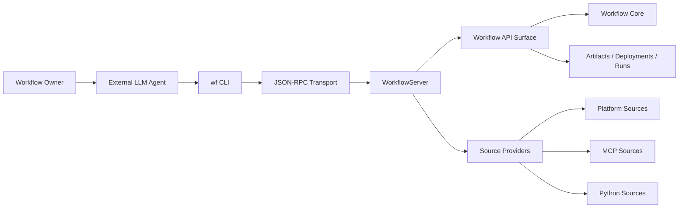
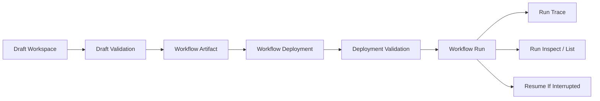
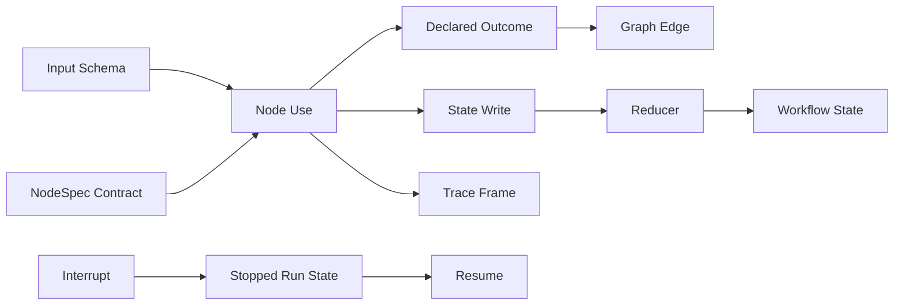
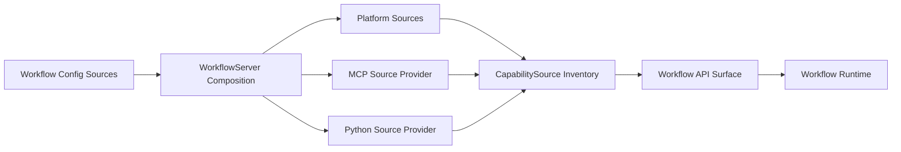

# Introduction

External LLM agents are useful workflow authors and operators, but reusable
workspace automation needs a typed execution substrate. This report describes
the design and implementation of `lda.chat`, a prototype platform where agents
can author, validate, execute, and inspect reusable workspace workflows without
making the LLM itself responsible for runtime state, validation, source binding,
or persistence.

The central claim is that agent-facing workflow automation should separate
planning from execution. The LLM or human author can propose and revise workflow
structure, while the platform owns artifacts, deployments, runs, source
inventory, validation diagnostics, traces, and resumability.

The research question guiding this work is: how can an AI-agent-facing workflow
platform represent, validate, execute, and persist reusable workspace
automations while keeping planning separate from deterministic execution?

The short version of the thesis is: the LLM plans; the runtime executes; source
providers expose capabilities; stores preserve durable lifecycle records. The
implementation demonstrates this model across controlled built-in, MCP, and
Python source examples.

**Scope of claims.** This report does not claim production security, broad
external-agent evaluation, arbitrary mid-node crash recovery, scheduling,
role-based access control, general workflow parallelism, or a bundled autonomous
agent brain. Claims about planner efficiency are design hypotheses supported by
structured diagnostics and controlled examples, not measured retry-reduction
results.

## Report Outline

Section 2 frames the problem that motivates a separate execution substrate.
Section 3 positions the system against related approaches. Section 4 describes
the conceptual model of workflows, artifacts, deployments, runs, and source
bindings. Section 5 presents the system architecture and its layered boundaries.
Section 6 details the implementation of each layer. Section 7 walks through a
deterministic report-preparation case study backed by a Python source. Section 8
evaluates the implementation against concrete evidence. Sections 9 and 10
discuss limitations and future work. Section 11 concludes.


# Problem Statement And Requirements

Current agent/tool systems frequently let an LLM directly orchestrate side
effects through ad hoc tool calls. This pattern creates several practical
problems for workspace automation:

- **Weak validation before execution.** A planner that assembles tool-call
  sequences often lacks a typed contract describing what each step expects and
  produces. Invalid plans reach the runtime and fail at execution time rather
  than during authoring.

- **Poor resumability after interruption.** Raw tool-call loops do not
  checkpoint their progress. If the process restarts, the agent must reconstruct
  its prior state from scratch or lose work.

- **Hard-to-audit traces.** Successful tool-call chains leave logs, but the
  causal structure of a multi-step procedure is not separated from the transport
  or provider noise. Inspecting what happened, why a step failed, or what the
  intermediate state was requires manual log parsing.

- **Limited reuse.** A successful tool-call procedure is embedded in a
  conversation transcript or script. Extracting it into a named, versioned,
  redeployable artifact is manual work the agent is not equipped to perform
  reliably.

- **Unclear boundaries between planning, execution, and provider-specific
  state.** When an LLM is responsible for both deciding what to do and
  managing runtime state, auth tokens, session pools, or source catalogs, the
  two concerns become entangled. Provider drift, stale sessions, or auth
  failures become hard to diagnose.

The automation target for this platform is reusable workspace procedures, not
arbitrary office work end-to-end. Examples include document transformation, data
collection, tool and API calls, report preparation, and monitoring checks.
Scheduled execution is a future deployment mode, not implemented in this
prototype. The thesis frames the platform as a response to these pressures: a
typed execution substrate where durable lifecycle records, validation, source
binding, and trace inspection are first-class platform concerns rather than
responsibilities of the planner.

The design requirements that follow from this problem statement are:

1. Typed workflow artifact, deployment, and run lifecycle with explicit schemas.
2. Source-provider boundary supporting MCP, Python, and future source families.
3. Durable server, API, and CLI surface that external agents can drive.
4. Validation and inspection mechanisms intended to reduce planner
   trial-and-error.
5. Next-action guidance that points an agent toward useful lifecycle operations
   without replacing validation.
6. Deterministic execution for the thesis-critical evidence path.


# Positioning And Related Systems

The system occupies a specific position in the automation landscape. It does
not attempt to replace mature platforms in their strengths, but rather
explores a different center of gravity: external AI agents can drive the
authoring and execution lifecycle directly through typed contracts.

## Direct LLM Tool Orchestration

Direct tool orchestration through an LLM is the most flexible approach. The
planner can call any tool in any sequence, and adaptation is immediate. However,
this flexibility comes at the cost of durability, validation, and resumability.
The platform argues that durable workspace automation benefits from separating
planning from a typed execution substrate.

## Generated Scripts

Generated scripts are a serious baseline. For many tasks, a script is simpler,
more maintainable, and easier to debug than a workflow graph. The platform
argument is that reusable workspace automation benefits from lifecycle
affordances that scripts do not automatically provide: typed validation, source
binding, artifact/deployment separation, run records, resumability, trace
inspection, and repairable diagnostics.

## Workflow Automation Platforms

Platforms such as Zapier and RPA tools are stronger today at polished
non-programmer UIs, large integration catalogs, hosted scheduling and
triggers, and operational maturity. The prototype does not claim feature parity
with these products. Instead, it explores a different trade-off: a platform
where external AI agents can operate the full lifecycle directly, where local
Python and MCP sources share one workflow surface, and where artifacts,
deployments, runs, and traces are first-class inspectable records.

## Agent Graph Frameworks

LangGraph-style durable agent graphs share the idea of typed execution
substrates for agent workflows. The emphasis in those systems is typically on
agent state machines, memory, and tool-call graphs for autonomous agents. The
lda.chat platform focuses on reusable workspace workflows backed by explicit
source providers, where the workflow is a deployable artifact independent of any
particular agent instance.

## Model Context Protocol

MCP is a useful protocol for exposing tools, resources, and prompts. It is not
itself the workflow artifact, deployment, and run lifecycle. The lda.chat
platform treats MCP as one source family behind a provider boundary, not as the
product identity. This distinction is important: MCP demonstrates why
source-provider correctness matters, because a source may require persistent
sessions, auth context, catalog refresh, and prompt inventory. The platform
places this complexity behind a neutral `CapabilitySource` interface.


# Conceptual Model

## Working Glossary

The document uses these terms with specific meanings:

| Term | Meaning | Example |
| --- | --- | --- |
| Workflow capability | A workflow-facing callable operation exposed by a source. | `local.report.extract_report` |
| `NodeSpec` | The typed contract for a capability: input schema, output schema, and outcomes. | a Python `@node` projection |
| Source | A namespace and owner of capabilities, resources, prompts, and metadata. | `local.report`, `wf.std` |
| Source family | A class of source implementations. | built-in, MCP, Python |
| Source provider | Server-side code that loads or manages sources for a source family. | Python source loading |
| Tool | A provider-native operation before projection into workflow form. | MCP tool |
| Deployment binding | A mapping from logical workflow source requirement to concrete source id. | `local.report=local.report` |
| Source drift | Divergence between saved workflow requirements and the currently resolved source inventory. | missing capability or changed schema |

## Workflows as Typed Graphs

A workflow is a typed graph where nodes invoke named capabilities and edges
route by declared outcomes. The graph model is defined by four schema contracts:

- `input_schema`: validates run input.
- `state_schema`: defines workflow memory and reducer behavior.
- `output_schema`: defines the final result shape.
- Outcome declarations: route control flow through graph edges.

Each node references a `NodeSpec`---a typed contract describing input schema,
output schema, and declared outcomes. Reducers merge repeated or otherwise
multi-writer state updates safely. General fork/gather parallelism is future
work, so this report does not claim complete concurrent graph semantics.
Interrupts represent typed external input points. Subgraphs compose workflows as
nodes.

The graph model improves the safety posture by making automation structure
explicit. Node contracts, source requirements, state writes, outcomes,
validation gates, and trace records are visible before and after execution. The
platform does not guarantee safe behavior from provider code, credentials, or
external side effects, but it makes the orchestration structure inspectable.

A key distinction in the model is between outcomes and output. Outcomes control
routing through the graph. Output carries business data. This separation allows
the same node to produce different routing signals while its data payload
follows typed schemas.

## Lifecycle Objects

Four distinct lifecycle objects separate concerns across the workflow lifecycle:

1. **Draft workspace.** Mutable authoring state for agent or human iteration.
   A draft captures the evolving plan, source selections, and validation
   diagnostics before any commitment to an immutable artifact.

2. **Workflow artifact.** An immutable, versioned workflow definition. An
   artifact records the graph plan, input/output/state schemas, required
   capabilities with schema snapshots, and a catalog version reference. Once
   saved, an artifact does not change.

3. **Deployment.** A binding contract from an artifact version to a concrete
   source and runtime context. Deployments map logical source requirements to
   concrete source identifiers and carry a drift policy that determines
   behavior when source catalogs change.

4. **Run.** An execution record with status, diagnostics, output, trace, and
   resumable stopped or interrupted state. In this report, durability means
   persisted artifact/deployment/run records and resumability from explicit
   stopped or interrupted boundaries. It does not mean arbitrary mid-node crash
   recovery, transactional side-effect recovery, or exactly-once execution.

This separation ensures that authoring, versioning, environment binding, and
execution are distinct operations with distinct lifecycle affordances.

## Source Model

The common boundary is `CapabilitySource`. The runtime does not care where a
`NodeSpec` came from; source-specific behavior belongs in provider packages and
server composition.

Four source families exist today:

| Source | Kind | Role |
| --- | --- | --- |
| `wf.std` | `system` | Built-in workflow nodes and reducers |
| `wf.recipes` | `system` | First-party workflow recipes |
| MCP sources | `connection` | Upstream MCP tools, resources, prompts |
| Python sources | `python` | Trusted project-local `NodeSpec` registries |

Platform sources such as `wf.std` and `wf.source` are process-provided and do
not require deployment self-bindings. Configured sources such as MCP and Python
remain explicit server or operator choices.

The provider seam is intentionally narrow:

```python
class WorkflowSourceProvider(Protocol):
    def load_sources(self) -> Mapping[str, CapabilitySource]: ...
```

This covers source families that can project configured inventory into
workflow-facing `CapabilitySource` objects. Provider-specific runtime pools,
admin hooks, auth, catalog caches, and health checks stay outside this seam
until multiple source families need the same abstraction. The narrow seam is
intentional: it prevents MCP-specific session/auth lifecycle concerns from
becoming requirements for simpler source families such as built-ins or trusted
Python sources.

Source resolution follows a deterministic path: a logical source requirement in
a workflow is checked against platform sources first, then resolved through
deployment bindings to concrete sources. The runtime then delegates to the
appropriate source handler.

## Source Resolution Path

The resolution path for a source reference is:

1. A workflow stores logical source references (e.g., `local.report`).
2. At runtime, platform sources such as `wf.std` resolve immediately to
   fixed source IDs without deployment bindings.
3. Configured sources are resolved through the deployment's binding map, which
   maps logical names to concrete source identifiers.
4. The concrete source is looked up in the server's source inventory and
   delegated to the appropriate runtime handler.

This design allows workflow portability across environments: the same artifact
can be deployed with different concrete source bindings, while the workflow
graph references logical names only.


# System Architecture

The architecture is organized into layered boundaries, each with a distinct
responsibility.

## Architecture Spine

This diagram answers: who calls whom across the user, agent, transport, server,
API, runtime, and source-provider boundaries?



The diagram shows the primary flow: a workflow owner expresses intent to an
external LLM agent, which drives the `wf` CLI. The CLI communicates over
JSON-RPC transport to a `WorkflowServer`. The server exposes a Workflow API
Surface that delegates to the deterministic Workflow Core for graph execution and
to platform domain objects for artifact, deployment, and run management. Source
providers supply capabilities to the API surface without the core runtime being
aware of provider-specific details.

## Layer Responsibilities

The layered architecture separates concerns as follows:

- **Workflow Core.** Deterministic execution semantics for graph, state,
  outcomes, trace, and resume rules. The core owns no provider-specific logic.

- **Workflow API Surface.** Application operations over capabilities, drafts,
  artifacts, deployments, and runs. The API surface consumes source DTOs through
  a neutral `WorkflowSpecProvider` and delegates to the core for execution.

- **Platform Domain.** Draft workspaces, workflow artifacts, deployments, run
  records, source inventory snapshots, validation diagnostics, and next-action
  guidance.

- **Server Composition.** `WorkflowServer` assembles concrete stores, sources,
  runtimes, and admin surfaces into a long-lived service. The server composes
  configured providers from workflow config into a live source inventory.

- **Transport.** JSON-RPC over HTTP as the current transport implementation.
  The transport is protocol-neutral; the Workflow API Surface is the stable
  boundary.

- **Source Providers.** MCP, Python, and future source families project their
  inventory into `CapabilitySource` objects. Provider-specific behavior such as
  MCP session pools or Python module loading stays within the provider package.

## Workflow Lifecycle

The lifecycle of a workflow through the platform follows a defined path:
this diagram answers what durable record or validation gate is created at each
stage.



Each stage is a distinct platform operation with typed inputs and outputs.
Draft validation checks schema conformance and source availability. Artifact
saving captures an immutable snapshot. Deployment validation verifies that
bound sources are currently available and compatible. Source drift is treated as
divergence between saved artifact capability requirements and the currently
resolved source inventory: missing bindings, missing or disabled sources,
missing capabilities, or changed schema contracts. Run execution produces
persisted records with trace slices and resumable stopped state.

## Workflow Core Model

The core model processes graph execution through typed stages:
this diagram answers what happens during one run at the graph-execution level.



Input validation gates entry. Each node use invokes a `NodeSpec` and produces a
declared outcome, a state write, and a trace frame. Outcomes route through graph
edges. Reducers merge state writes safely. Interrupts produce stopped run state
that can be resumed.

## Source Provider Boundary

The source provider boundary separates configured source families from the
workflow API surface. This diagram answers where source-specific code stops and
workflow-facing inventory begins.



Platform sources are always present. Configured sources are operator choices
declared in the workflow config. The server composes all sources into a unified
`CapabilitySource` inventory that the workflow API surface consumes without
provider-specific knowledge.


# Implementation

## Package Structure

The implementation is organized into focused packages with clear boundaries:

| Package | Responsibility |
| --- | --- |
| `wf_core` | Deterministic workflow kernel: graph execution, state, outcomes, trace, resume |
| `wf_authoring` | Authoring support: `NodeSpec`, drafts, wrappers, API surfaces, source providers |
| `wf_platform` | Neutral source DTOs, source visibility, permissions, and policy |
| `wf_artifacts` | Artifact, deployment, and run models; file-backed stores; validation |
| `wf_api` | Application surface: capabilities, drafts, artifacts, deployments, runs |
| `wf_server` | `WorkflowServer` composition from config, stores, and source providers |
| `wf_transport_rpc_http` | JSON-RPC over HTTP transport for CLI and future clients |
| `wf_sources_mcp` | MCP upstream source implementation and persistent runtime pool |
| `wf_sources_python` | Trusted in-process Python source loading and `NodeSpec` projection |
| `wf_cli` | CLI commands driving the JSON-RPC transport |

(Evidence: `docs/source_architecture.md`, package boundaries in `src/`.)

## Workflow Core

The workflow core implements deterministic execution semantics. It processes a
typed graph definition, validates input against `input_schema`, executes the
selected node use, routes by declared outcomes, applies reducers to state
writes, and produces trace frames. The current public semantics are serial graph
execution with explicit outcomes and interrupts; general fork/gather
parallelism is future work. The core is provider-agnostic; it sees `NodeSpec`
contracts, not source-specific implementations.

State writes go through reducers. The platform includes a built-in `wf.std`
reducer family. Reducers are themselves `NodeSpec` contracts that can be
composed into workflows. Interrupts produce stopped run state with a resumable
checkpoint.

(Evidence: `src/wf_core/`.)

## Platform Domain Objects

The platform domain defines the lifecycle objects as Pydantic models:

- `WorkflowArtifact` captures the immutable artifact definition with required
  capabilities, schema snapshots, and catalog version references.
- `WorkflowDeployment` captures source bindings with a drift policy and binding
  contract.
- Run records track execution status, diagnostics, output, and trace counts.

Source binding uses `SourceBinding` objects that map logical source names to
concrete source identifiers. The `CapabilitySource` dataclass is the neutral
DTO that all source providers project into.

(Evidence: `src/wf_artifacts/models.py`, `src/wf_platform/sources.py`.)

## Validation And Diagnostics

Validation operates at multiple lifecycle points:

1. **Draft validation** checks schema conformance, source availability, and
   graph structure before an artifact is saved.
2. **Deployment validation** verifies that bound sources are currently
   available and that required capabilities match the source inventory.
3. **Run validation** checks input against the artifact's input schema before
   execution begins.

When validation fails, the platform produces machine-readable diagnostics with
severity, error code, logical source reference, repair hint, and the bound
source. These diagnostics are designed for machine clients: an LLM agent can
read the diagnostic and determine what to fix without blind probing.

Deployment validation also detects source drift. If a source changes
incompatibly and a deployment becomes unrunnable, the system reports the
diagnostic with a repair hint rather than silently executing against
incompatible capabilities.

(Evidence: `src/wf_artifacts/validation.py`, `tests/artifacts/test_validation.py`.)

## Next-Action Guidance

The platform provides advisory continuation hints through `NextActions`. This
object tells a machine client whether there is an obvious next workflow-surface
tool call, what that tool is, and why. It is guidance, not authority: validation
diagnostics and runtime status remain the source of truth.

The `NextActions` object includes `can_continue`, `recommended_next_tool`,
`reason`, and `patch_examples` with concrete request payloads. This makes the
surface agent-operable: an LLM agent can read the hint and execute the suggested
operation without reconstructing the lifecycle state.

(Evidence: `src/wf_api/next_actions.py`.)

## Server Composition

`WorkflowServer` is the composition boundary. It assembles concrete stores,
source providers, runtimes, and admin surfaces from workflow config. The server
does not own workflow semantics; it delegates to `WorkflowApi` for application
operations.

The config model specifies store configuration, transport endpoints, and source
provider declarations. Sources are declared as discriminated unions by kind:
`mcp`, `python`, or future kinds like `openapi`.

(Evidence: `src/wf_server/config.py`.)

## JSON-RPC Transport

The JSON-RPC-over-HTTP transport exposes the Workflow API Surface to CLI and
future HTTP clients. The transport is protocol-neutral; it maps JSON-RPC
method calls to `WorkflowApi` operations and returns structured JSON responses.

The CLI communicates over this transport. CLI commands are designed as
agent-operable first: structured output, status and inspect commands, validation
commands, compact summaries, and guarded destructive actions make the CLI a
practical surface for external agents.

(Evidence: `src/wf_transport_rpc_http/`, `src/wf_cli/`, `tests/wf_cli/`.)

## MCP Source Provider

MCP is one source family and a useful stress test for source-provider
correctness. A workflow capability call should not silently turn a stateful
external provider into a fresh one-off client call when provider state is part
of correctness. The platform contribution is the source-provider boundary and
workflow lifecycle, not an MCP wrapper.

The MCP source provider manages:

- Source identity and connection description.
- Auth records and catalog cache storage.
- A live `ClientSession` facade.
- A persistent session pool for stateful upstream operations.
- MCP-to-workflow converters for tools, resources, and prompts.

The provider projects MCP tools into `NodeSpec` contracts, making them callable
from workflow graphs through the same `CapabilitySource` boundary as Python or
built-in sources.

(Evidence: `src/wf_sources_mcp/`, `tests/wf_sources_mcp/test_runtime.py`,
`tests/wf_transport_rpc_http/test_mcp_backed_server_rpc.py`.)

## Python Source Provider

Python sources provide trusted developer extensibility. Project-local code can
become typed workflow capabilities quickly, but these are not sandboxed
non-programmer plugins.

The loading path is:

```text
PythonSourceConfig(path, module, registry)
  -> PythonSourceProvider
  -> import module
  -> load NodeSpec registry
  -> qualify specs under source id
  -> CapabilitySource(kind="python")
```

Python sources are static at server startup. No hot reload is implemented yet.
The provider imports the configured module, reads the named registry attribute,
and projects each `NodeSpec` into the workflow capability inventory.

(Evidence: `src/wf_sources_python/`, `tests/wf_sources_python/test_loader.py`.)


# Case Study: Deterministic Report Workflow

The thesis case study is a document/report preparation workflow backed by local
fixtures and trusted Python sources. It demonstrates the full lifecycle:
config validation, server startup, capability discovery, draft creation,
artifact saving, deployment validation, run execution, run inspection, and
trace viewing. The case study is deterministic and does not require an LLM
call, remote OAuth, or provider quota.

## Case Study Components

The example bundle lives at `examples/report_workflow/` and contains:

- `ops.py` --- a Python source exposing `read_notes`, `extract_report`, and
  `render_markdown_report` as typed `NodeSpec` capabilities.
- `input.md` --- fixture Markdown notes with summary, actions, risks, and
  followups sections.
- `cap-input.json` --- a capability-call payload generated from the fixture.
- `run-input.json` --- a workflow-run payload generated from the fixture.
- `wf.config.json` --- a local server and client config using the
  `local.report` Python source.

(Evidence: `examples/report_workflow/README.md`, `examples/report_workflow/ops.py`.)

## Python Source Definition

The Python source defines three capabilities with Pydantic input/output
schemas:

```python
@node(name="read_notes")
def read_notes(payload: ReadInput) -> ReadOutput:
    return ReadOutput(text=Path(payload.path).read_text(encoding="utf-8"))

@node(name="extract_report")
def extract_report(payload: ExtractInput) -> ReportOutput:
    # Parses Markdown sections into structured report fields
    ...

@node(name="render_markdown_report")
def render_markdown_report(payload: MarkdownInput) -> MarkdownOutput:
    # Renders structured report as Markdown
    ...
```

Each function is decorated with `@node`, which produces a `NodeSpec` with typed
input and output schemas. The registry is a plain list of decorated functions:

```python
registry = [read_notes, extract_report, render_markdown_report]
```

The `wf.config.json` configures the source as:

```json
{
  "kind": "python",
  "id": "local.report",
  "path": ".",
  "module": "ops",
  "registry": "registry"
}
```

This tells the Python source provider to import `ops.py`, read the `registry`
attribute, and project each function into the workflow capability inventory
under the `local.report` namespace.

(Evidence: `examples/report_workflow/ops.py`, `examples/report_workflow/wf.config.json`.)

## Lifecycle Runbook

The case study exercises the full lifecycle through CLI commands. The commands
demonstrate the agent-operable surface:

1. **Config validation.** `wf config validate` checks that the config file is
   well-formed and that the Python source module can be imported.

2. **Server startup.** `wf-rpc-server --config wf.config.json` starts the
   workflow server with the configured store, transport, and source providers.

3. **Status check.** `wf status` confirms the server is reachable.

4. **Capability discovery.** `wf cap list --source local.report` lists the
   three capabilities exposed by the Python source.

5. **Capability call.** `wf cap call local.report.extract_report --input-file
   cap-input.json --format compact` invokes the extraction capability and
   returns structured JSON.

6. **Draft creation.** `wf draft create-from-capability report_ws
   local.report.extract_report` seeds a draft workspace from the capability's
   input/output schemas.

7. **Draft validation.** `wf draft validate report_ws` checks schema
   conformance and source availability.

8. **Artifact saving.** `wf draft save report_ws --artifact report_case_study
   --version 1 --title "Report Case Study" --binding local.report=local.report`
   saves an immutable artifact with source bindings.

9. **Deployment saving.** `wf deploy save report_case_study.default --artifact
   report_case_study --version 1 --binding local.report=local.report` creates
   a deployment binding.

10. **Deployment validation.** `wf deploy validate report_case_study.default`
    verifies that bound sources are available and compatible.

11. **Run execution.** `wf run start report_case_study.default --input-file
    run-input.json --trace-from 0 --trace-limit 5` starts a workflow run.

12. **Run inspection.** `wf run inspect <run_id>` shows the run status, output,
    and diagnostics.

13. **Run trace.** `wf run trace <run_id> --from 0 --limit 5` shows the trace
    frames recorded during execution.

(Evidence: `examples/report_workflow/README.md`, `tests/examples/test_report_workflow_example.py`.)

## Expected Output

The case study produces a structured report with:

- Title: "Weekly Project Update"
- Three action items with owner, task, and due date
- Risks mentioning Google Drive MCP quota
- Followups for Markdown rendering and baseline comparison

The output matches the typed `ReportOutput` schema, making validation
deterministic.

## Automated Test Evidence

The case study is backed by automated tests that exercise the same lifecycle
programmatically:

1. **Capability load and call.** A test loads the config, builds the server,
   lists capabilities under `local.report`, and calls `extract_report` with
   fixture input. The test asserts the outcome is `ok`, the title matches, and
   the action items and risks contain expected values.

2. **Artifact/deployment/run path.** A test builds a workflow plan with a
   single `extract` node, saves the artifact, creates a deployment with source
   bindings, starts a run, and asserts that the run completes with the expected
   typed output.

(Evidence: `tests/examples/test_report_workflow_example.py`.)


# Evaluation

The evaluation uses concrete evidence: automated tests, live smoke tests, and
the deterministic case study. The evidence claim is that the prototype
demonstrates the architecture and workflow lifecycle under controlled examples.

## Evaluation Criteria

The evaluation is organized around criteria derived from the research question:

| Criterion | Question | Evidence Type |
| --- | --- | --- |
| Representation | Can workflow intent be represented as artifacts, deployments, and runs? | model/API tests |
| Validation | Can invalid drafts, deployments, source bindings, and source drift be reported before or during execution? | validation/diagnostic tests |
| Execution | Can a deterministic workflow execute through the same API/CLI lifecycle used by agents? | report-workflow case study |
| Persistence | Are lifecycle records persisted, and can stopped/interrupted runs resume at defined boundaries? | run-store and resume tests |
| Source extensibility | Can different source families expose capabilities without changing `wf_core`? | built-in, MCP, and Python source tests |
| Agent-operable surface | Can clients drive the lifecycle through structured CLI/API responses? | CLI and JSON-RPC tests |

This is a prototype system evaluation, not a broad user study or reliability
benchmark.

## Qualitative Comparison

| Capability | Direct LLM tool loop | Generated script | Mature automation platform | `lda.chat` prototype |
| --- | --- | --- | --- | --- |
| Versioned workflow artifact | Usually no | Manual | Often yes | Yes |
| Deployment/source binding | Usually no | Manual config | Platform-specific | Yes |
| Typed validation before run | Limited | Custom | Varies | Yes |
| Durable run record | Conversation/log | Custom | Often yes | Yes, at stopped boundaries |
| Source drift diagnostics | No | Custom | Varies | Yes, controlled examples |
| Agent-operable repair hints | No | No | Usually human UI | Prototype support |
| Scheduling | Depends on agent | External scheduler | Yes | Future work |

The comparison positions the architecture; it is not a quantitative claim that
the prototype outperforms mature automation products.

## Evidence Package

The evidence supporting the thesis claims includes:

### Architecture And Code Walkthrough

The four-layer architecture (core, API surface, server composition, transport)
is implemented in separate packages with clear boundaries. The Workflow API
Surface is protocol-neutral; JSON-RPC and CLI are transport implementations
that delegate to the same `WorkflowApi` facade.

### Workflow Lifecycle Tests

Automated tests cover artifact creation, deployment validation, run execution,
run inspection, and trace retrieval. These tests exercise the full lifecycle
from plan to completed run.

(Evidence: `tests/wf_api/test_artifact_api.py`, `tests/wf_api/test_run_api.py`.)

### Validation And Diagnostics Tests

Tests verify that draft validation catches schema violations, deployment
validation detects source drift, and diagnostics include repair hints. The
validation tests demonstrate that failed states are machine-readable and
repairable.

(Evidence: `tests/artifacts/test_validation.py`, `tests/wf_api/test_source_admin_api.py`.)

### Source Provider Tests

MCP source provider tests cover tool discovery, resource listing, prompt
inventory, stateful session reuse, and auth binding. Python source provider
tests cover module import, `NodeSpec` projection, and capability calling. The
tests exercise the source-provider boundary across different source families.

(Evidence: `tests/wf_sources_mcp/test_runtime.py`,
`tests/wf_sources_python/test_loader.py`,
`tests/wf_transport_rpc_http/test_mcp_backed_server_rpc.py`.)

### Stateful MCP Session Tests

MCP-backed server tests verify that stateful sessions are reused across
workflow calls rather than creating fresh one-off clients. This demonstrates
source-provider correctness for providers whose behavior depends on session
state.

(Evidence: `tests/wf_sources_mcp/test_runtime.py`,
`tests/wf_transport_rpc_http/test_mcp_backed_server_rpc.py`.)

### Python Source Case Study

The report workflow example demonstrates the source abstraction is not
MCP-only. A Python source with three typed capabilities exercises the full
lifecycle from config validation through run execution.

(Evidence: `examples/report_workflow/`,
`tests/examples/test_report_workflow_example.py`.)

### CLI And Transport Tests

CLI and transport tests verify that the agent-operable surface works through
JSON-RPC. Structured output, validation commands, and inspect commands produce
machine-readable responses.

(Evidence: `tests/wf_cli/`, `tests/wf_transport_rpc_http/`.)

### Config Validation

Config validation catches import and path errors before server startup. This
prevents the server from starting with broken source configurations, reducing
blind agent retries.

(Evidence: `src/wf_config/`.)

## Planner Efficiency Hypothesis

The platform targets planner efficiency and operational clarity rather than
runtime throughput. The design hypothesis is that typed contracts, validation,
diagnostics, compact outputs, and traces are intended to reduce blind retries:

- Validation calls return structured diagnostics with repair hints.
- Source catalogs let agents discover available capabilities without probing.
- Compact JSON output is intended to reduce token usage compared to raw
  provider payloads.
- Next-action guidance provides a suggested next step without the agent having
  to reconstruct lifecycle state.

A before/after comparison is illustrative: in early ad-hoc agent/tool
interaction, an agent might spend multiple attempts discovering a valid tool
sequence through trial and error. With the typed lifecycle, the agent validates
a draft, reads the diagnostic, fixes the specific issue, and proceeds. This
report evaluates whether the diagnostic and lifecycle surfaces exist and are
actionable; it does not yet measure retry reduction, token savings, or
convergence rates across agents.

Threat to validity: no controlled agent study was conducted. Claims regarding
agent efficiency, convergence, retry reduction, or token savings should be
interpreted as design hypotheses rather than experimentally validated results.

## Evaluation Questions

The implementation addresses these evaluation questions:

1. Can a source capability be discovered, called, saved into a workflow,
   deployed, and run? --- Yes, demonstrated by the Python source case study and
   its automated tests.

2. Can an interrupted run persist at an explicit interruption boundary and
   resume? --- Yes, demonstrated by run persistence and resume tests.

3. Can the same server be used through CLI and JSON-RPC transport? --- Yes,
   the CLI and transport tests exercise both surfaces against the same server
   composition.

4. Can a new source family be added without changing `wf_core`? --- Yes, the
   source-provider boundary is in `wf_platform` and `wf_server`, not in the
   core. Python sources were added without modifying the core package.

5. Are large raw provider payloads bounded in CLI output? --- Yes, the
   `SOURCE_PREVIEW_LIMIT` constant and compact output formats bound payload
   size in CLI responses.

6. Can platform sources such as `wf.std` be used without self-bindings? --- Yes,
   platform sources have `binding_required: False` in their source policy, and
   deployment validation rejects unnecessary platform source bindings.

7. Can source resources be referenced by logical source and dereferenced
   through a bounded helper? --- Yes, `wf.source.read_resource` resolves
   logical source refs through runtime context with bounded output policy.

8. Does the structured surface reduce failed attempts before success? --- Not
   measured in this report. The validation diagnostics, compact output, and
   next-action guidance are designed for this purpose, but retry reduction
   remains future evaluation work.

9. Do validation and deployment validation catch source drift? --- Yes,
   deployment validation reports unrunnable state with diagnostics instead of
   silently executing against incompatible capabilities.


# Limitations

The following limitations are stated explicitly to maintain credibility and
motivate future work:

## Threat Model And Non-Goals

The prototype assumes trusted operators, trusted local Python sources, and
non-production credential handling. It does not attempt sandboxing,
least-privilege execution, multi-tenant isolation, human approval gates,
role-based authorization, or secret-manager-backed auth. These are product and
deployment concerns beyond the controlled system-design evidence in this report.

- **Python sources are trusted in-process code.** No sandbox is implemented.
  A Python source can execute arbitrary code within the server process.

- **Python sources are static at server startup.** No hot reload is
  implemented. Changing a Python source requires restarting the server.

- **Source provider lifecycle is early.** The provider seam covers static
  inventory loading. Admin, apply, auth, and live health checks are not part
  of the current provider protocol, especially for non-MCP mutable sources.

- **Workflow portability is scoped.** Local Python code, MCP catalogs, auth
  records, and source stores can differ between environments. An artifact that
  is runnable in one environment may require different bindings in another.

- **No broad external evaluation.** The prototype has not been evaluated against
  a large external provider catalog or a broad user study. The evidence claim
  is limited to controlled examples.

- **File-backed stores.** The current implementation uses filesystem stores as
  proof for durable lifecycle. Durability itself should not be framed as
  filesystem-specific; SQL or transactional stores are future work.

- **Prototype auth.** Auth records and admin surfaces exist as plumbing for
  source readiness. End-to-end production credential handling, encrypted-at-rest
  storage, and secret-manager integration are not verified as core thesis
  claims.

- **No run deletion.** Run records cannot be deleted through the current API.

- **No MCP widget/resource proxying.** Upstream interactive widgets are not
  carried through the durable workflow path.

- **Crash recovery at stopped boundaries.** Recovery is available at
  stopped/interrupted run boundaries, not at arbitrary mid-node checkpoints.

- **No offline scheduling.** Scheduled execution of deployments is not
  implemented.

- **No visual workflow editor.** The platform is driven through CLI and API
  surfaces; no graphical editor exists yet.

- **No bundled autonomous agent brain.** The platform serves external agents;
  it does not include a built-in agent.

- **No general fork/gather.** Fork and gather workflow control is future work.

- **No approval, roles, policy, or multi-user review.** There is no
  role-based access control or review workflow.


# Future Work

The following areas are identified as likely future work:

- **Provider lifecycle.** Add, update, remove, apply, and reload operations
  for multiple source families. Extend the provider protocol beyond static
  inventory loading.

- **OpenAPI or fetch-style source provider.** Broader HTTP integration through
  a new source family, complementing MCP and Python sources.

- **Python development reload.** Hot reload for Python sources during
  development, without requiring server restart.

- **LLM nodes as typed source capabilities.** LLM calls exposed as
  `NodeSpec` contracts, allowing planners to compose LLM steps into workflows
  without making the core runtime model-aware.

- **Production auth and secret stores.** Encrypted-at-rest credential storage,
  secret-manager integration, and production-grade auth flows.

- **SQL and transactional stores.** Replace file-backed stores with
  transactional storage for production durability.

- **Scheduler and daemon operations.** Offline scheduling for deployments,
  cron-triggered runs, and server daemon lifecycle.

- **Fork and gather workflow control.** General parallel execution and result
  aggregation within workflow graphs.

- **Richer run debugging.** Time-travel debugging, run rewind, and
  mid-execution inspection beyond stopped and interrupted resume.

- **UI and admin dashboard.** First-party workflow UI for listing, inspecting,
  and editing workflows.

- **Richer evaluation.** Larger source catalogs, real-world workflow
  benchmarks, and broader agent evaluation with more attempts and failure
  categories.


# Conclusion

External LLM agents can author and operate workflows, but reusable workflow
life cycle records should live in a typed platform substrate. This report
described the design and implementation of `lda.chat`, a prototype platform
that separates planning from execution across controlled built-in, MCP, and
Python source examples.

The implementation supports five claims:

1. A typed artifact, deployment, and run lifecycle provides persisted workflow
   records and resumability at explicit stopped/interrupted boundaries.
2. The source-provider boundary allows MCP, Python, and future source families
   to share one workflow surface without core-runtime changes.
3. Validation and diagnostics produce machine-readable repairable failure
   states intended to reduce planner trial-and-error.
4. The CLI and JSON-RPC transport provide an agent-operable surface that
   external LLM agents can drive without direct runtime access.
5. The deterministic report-workflow case study demonstrates the full lifecycle
   from config validation through run execution and trace inspection.

The remaining work is clear and bounded: provider lifecycle, production auth,
scheduling, fork/gather, richer debugging, and broader evaluation. The prototype
demonstrates the architecture; the thesis contribution is the platform design
and evidence that the design can work across multiple source families under
controlled conditions.


# Appendices

## Appendix A: Case Study Command Transcript

The following commands demonstrate the full lifecycle of the report workflow
case study. All commands assume execution from the repository root.

### Config Validation

```powershell
uv run wf config validate examples/report_workflow/wf.config.json
```

### Server Startup

```powershell
uv run wf-rpc-server --config examples/report_workflow/wf.config.json
```

### Status Check

```powershell
uv run wf --config examples/report_workflow/wf.config.json status
```

### Capability Discovery

```powershell
uv run wf --config examples/report_workflow/wf.config.json cap list --source local.report
```

### Capability Call

```powershell
uv run wf --config examples/report_workflow/wf.config.json cap call local.report.extract_report --input-file examples/report_workflow/cap-input.json --format compact
```

### Draft Creation

```powershell
uv run wf --config examples/report_workflow/wf.config.json draft create-from-capability report_ws local.report.extract_report --name report_case_study --title "Report Case Study"
```

### Draft Validation

```powershell
uv run wf --config examples/report_workflow/wf.config.json draft validate report_ws
```

### Artifact Saving

```powershell
uv run wf --config examples/report_workflow/wf.config.json draft save report_ws --artifact report_case_study --version 1 --title "Report Case Study" --binding local.report=local.report
```

### Deployment Saving

```powershell
uv run wf --config examples/report_workflow/wf.config.json deploy save report_case_study.default --artifact report_case_study --version 1 --binding local.report=local.report
```

### Deployment Validation

```powershell
uv run wf --config examples/report_workflow/wf.config.json deploy validate report_case_study.default
```

### Run Execution

```powershell
uv run wf --config examples/report_workflow/wf.config.json run start report_case_study.default --input-file examples/report_workflow/run-input.json --trace-from 0 --trace-limit 5
```

### Run Inspection

```powershell
uv run wf --config examples/report_workflow/wf.config.json run list --limit 5
uv run wf --config examples/report_workflow/wf.config.json run inspect <run_id>
```

### Run Trace

```powershell
uv run wf --config examples/report_workflow/wf.config.json run trace <run_id> --from 0 --limit 5
```

## Appendix B: Evidence Index

See `evidence-index.md` for the full claim-to-evidence map.

| Claim | Evidence |
| --- | --- |
| Workflow lifecycle models | `src/wf_artifacts/models.py`, `src/wf_artifacts/runs/` |
| Source provider boundary | `src/wf_platform/sources.py`, `src/wf_server/config.py` |
| JSON-RPC/CLI surface | `src/wf_transport_rpc_http/`, `src/wf_cli/` |
| Python source case study | `examples/report_workflow/`, `tests/examples/test_report_workflow_example.py` |
| MCP stateful runtime | `tests/wf_sources_mcp/test_runtime.py`, `tests/wf_transport_rpc_http/test_mcp_backed_server_rpc.py` |
| Validation/diagnostics | `src/wf_artifacts/validation.py`, `src/wf_api/next_actions.py`, `tests/artifacts/test_validation.py` |
| Agent-operable surface | `src/wf_cli/`, `tests/wf_cli/` |
| Platform domain | `src/wf_api/service.py`, `tests/wf_api/test_artifact_api.py`, `tests/wf_api/test_run_api.py` |
