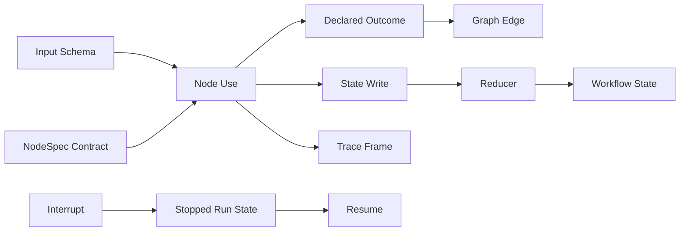
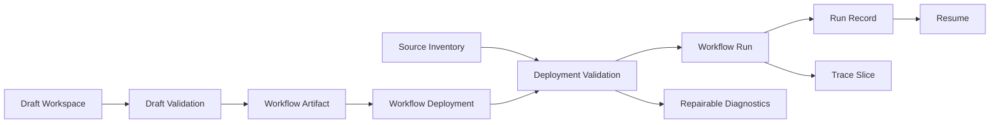
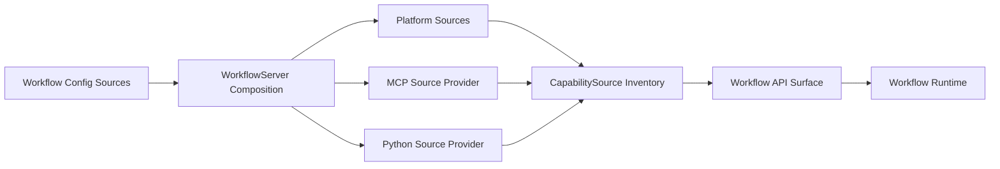

# Thesis System Design Document Implementation Plan

> **For agentic workers:** REQUIRED SUB-SKILL: Use superpowers:subagent-driven-development (recommended) or superpowers:executing-plans to implement this plan task-by-task. Steps use checkbox (`- [ ]`) syntax for tracking.

**Goal:** Produce a formal thesis-style system design and implementation document grounded in the current codebase, tests, diagrams, and reproducible evidence.

**Architecture:** The document should lead with concepts, then support them with verified implementation facts. Claims must be backed by code paths, tests, smoke output, or the runnable case-study bundle; do not invent product properties from aspirational roadmap text.

**Tech Stack:** Markdown with Pandoc-compatible frontmatter, Mermaid diagrams, PowerShell generation script in `docs/add/generate.ps1`, pytest docs smoke tests, ruff, basedpyright.

---

## Dependency

This plan should run after `docs/superpowers/plans/2026-06-14-thesis-case-study-evidence.md` or after an equivalent report-workflow example exists at `examples/report_workflow/`.

If `examples/report_workflow/README.md` does not exist, stop and implement the evidence plan first.

## Files

- Create: `docs/add/system-design-implementation.md` — the formal thesis/system-design document.
- Create: `docs/add/evidence-index.md` — concise map from thesis claims to code/tests/docs evidence.
- Modify: `docs/add/diagrams.md` — add stable Mermaid diagrams used by the Big Doc.
- Modify: `docs/add/thesis-outline.md` — mark which sections have been transferred to the Big Doc.
- Modify: `docs/project_map.md` — link the Big Doc and evidence index from the docs map.
- Modify: `docs/current_roadmap.md` — mark the Big Doc draft completed.
- Modify or create: `tests/docs/test_big_doc_links.py` — smoke-test links to key evidence files.

## Claim Verification Rule

Every factual claim in `docs/add/system-design-implementation.md` must be traceable to one of:

- a source file under `src/`
- a test under `tests/`
- a runnable example under `examples/report_workflow/`
- an existing live architecture doc such as `docs/source_architecture.md`
- a smoke/runbook file that states it is current

Use these commands before drafting implementation claims:

```powershell
rg 'class WorkflowArtifact|class WorkflowDeployment|class WorkflowRun' src/wf_artifacts -n
rg 'class WorkflowApi|WorkflowServer|WorkflowSourceProvider|CapabilitySource' src -n
rg 'McpRuntimePool|StatefulMcpRuntime|McpSourceClient' src/wf_sources_mcp src/wf_mcp -n
rg 'PythonSourceConfig|wf_sources_python|load_sources' src tests -n
rg 'next_actions|diagnostics|validate_deployment|validate_draft' src/wf_api src/wf_cli tests -n
```

Do not cite old plans in `docs/historical/**` as current behavior unless the text explicitly says the citation is historical motivation.

## Task 1: Build an Evidence Index

**Files:**
- Create: `docs/add/evidence-index.md`

- [ ] **Step 1: Create the evidence index**

Create `docs/add/evidence-index.md` with this structure:

```md
# Thesis Evidence Index

This file maps thesis claims to implementation evidence. It is not prose for the
final report; it is a guardrail against unsupported claims.

## Core Workflow Lifecycle

Claim: The platform separates mutable drafts, immutable artifacts, deployments,
runs, and traces.

Evidence:

- `src/wf_artifacts/models.py` — artifact/deployment models.
- `src/wf_artifacts/runs/` — run records and run store.
- `src/wf_api/service.py` — facade for workflow lifecycle operations.
- `tests/wf_api/test_artifact_api.py`
- `tests/wf_api/test_run_api.py`

## Source Provider Boundary

Claim: Workflow execution consumes source-provided capabilities without making
the core runtime MCP-specific.

Evidence:

- `src/wf_platform/sources.py` — neutral source DTOs and source policy.
- `src/wf_server/config.py` — server composition for configured sources.
- `src/wf_sources_mcp/` — MCP source family.
- `src/wf_sources_python/` — Python source family.
- `docs/source_architecture.md`

## Agent-Operable Surface

Claim: External agents can operate the workflow lifecycle through stable CLI/API
surfaces.

Evidence:

- `src/wf_cli/`
- `src/wf_transport_rpc_http/`
- `tests/wf_cli/`
- `tests/wf_transport_rpc_http/`
- `docs/wf_cli.md`

## Validation And Diagnostics

Claim: Validation and diagnostics make failed workflow states repairable.

Evidence:

- `src/wf_artifacts/validation.py`
- `src/wf_api/next_actions.py`
- `src/wf_api/source_admin.py`
- `tests/artifacts/test_validation.py`
- `tests/wf_api/test_source_admin_api.py`

## Stateful MCP Source Correctness

Claim: MCP-backed sources can preserve stateful sessions across workflow calls.

Evidence:

- `src/wf_sources_mcp/runtime/`
- `src/wf_sources_mcp/client/`
- `tests/wf_sources_mcp/test_runtime.py`
- `tests/wf_transport_rpc_http/test_mcp_backed_server_rpc.py`

## Python Source Case Study

Claim: The source-provider model is not MCP-only.

Evidence:

- `examples/report_workflow/`
- `src/wf_sources_python/`
- `tests/examples/test_report_workflow_example.py`
- `tests/wf_sources_python/test_loader.py`

## Limitations

Claim: This is a prototype platform substrate, not a finished automation product.

Evidence:

- `docs/add/thesis-outline.md`
- `docs/current_roadmap.md`
- absence of scheduler/visual-editor/secret-manager production packages in
  current source tree.
```

- [ ] **Step 2: Verify evidence paths exist**

Run:

```powershell
Test-Path docs/add/evidence-index.md
Test-Path src/wf_artifacts/models.py
Test-Path src/wf_platform/sources.py
Test-Path src/wf_sources_mcp/runtime
Test-Path src/wf_sources_python
Test-Path examples/report_workflow
```

Expected: all commands print `True`. If `examples/report_workflow` prints `False`, stop and implement the case-study evidence plan first.

- [ ] **Step 3: Commit evidence index**

Run:

```powershell
git add docs/add/evidence-index.md
git commit -m "docs: add thesis evidence index"
```

Expected: commit succeeds.

## Task 2: Add Stable Mermaid Diagrams

**Files:**
- Modify: `docs/add/diagrams.md`

- [ ] **Step 1: Add workflow core diagram**

Append this section to `docs/add/diagrams.md`:

````md
## Workflow Core


````

- [ ] **Step 2: Add platform domain diagram**

Append this section to `docs/add/diagrams.md`:

````md
## Platform Domain


````

- [ ] **Step 3: Add source provider diagram**

Append this section to `docs/add/diagrams.md`:

````md
## Source Provider Boundary


````

- [ ] **Step 4: Commit diagrams**

Run:

```powershell
git add docs/add/diagrams.md
git commit -m "docs: add thesis diagrams"
```

Expected: commit succeeds.

## Task 3: Draft the Formal Big Doc

**Files:**
- Create: `docs/add/system-design-implementation.md`

- [ ] **Step 1: Create frontmatter and introduction**

Create `docs/add/system-design-implementation.md` with this frontmatter and opening:

```md
---
title: "Design and Implementation of lda.chat"
subtitle: "Infrastructure for AI Agents to Author and Execute Workspace Workflows"
author: "draft"
date: "2026-06-14"
lang: "en-US"
documentclass: report
papersize: a4
fontsize: 10pt
toc: true
toc-depth: 2
numbersections: true
geometry:
  - top=30mm
  - bottom=30mm
  - left=32mm
  - right=32mm
mainfont: "Libertinus Serif"
sansfont: "Libertinus Sans"
monofont: "Libertinus Mono"
mathfont: "Libertinus Math"
colorlinks: true
linkcolor: "MidnightBlue"
urlcolor: "MidnightBlue"
toccolor: "MidnightBlue"
keywords:
  - workflow
  - agents
  - source providers
  - JSON-RPC
  - MCP
  - Python sources
header-includes:
  - \usepackage{graphicx}
  - \usepackage{booktabs}
  - \usepackage{hyperref}
  - \usepackage{hyperxmp}
  - \usepackage[dvipsnames]{xcolor}
  - \usepackage{fancyhdr}
  - \pagestyle{fancy}
  - \fancyhead[L]{\small lda.chat}
  - \fancyhead[R]{\small\leftmark}
  - \fancyfoot[C]{\thepage}
  - \setlength{\parskip}{0.6em}
  - \setlength{\parindent}{0pt}
  - \setkeys{Gin}{width=\linewidth,height=0.55\textheight,keepaspectratio}
  - \renewcommand{\arraystretch}{1.3}
  - \hypersetup{pdfauthor={lda.chat}, pdftitle={Design and Implementation of lda.chat}}
---

# Introduction

External LLM agents are useful workflow authors and operators, but durable
workspace automation needs a typed execution substrate. This report describes
the design and implementation of `lda.chat`, a prototype platform where agents
can author, validate, execute, and inspect reusable workspace workflows without
making the LLM itself responsible for runtime state, validation, source binding,
or persistence.

The central claim is that agent-facing workflow automation should separate
planning from execution. The LLM or human author can propose and revise workflow
structure, while the platform owns artifacts, deployments, runs, source
inventory, validation diagnostics, traces, and resumability.
```

- [ ] **Step 2: Add the required section skeleton**

Append these headings to `docs/add/system-design-implementation.md`:

```md

# Problem Statement And Requirements

# Positioning And Related Systems

# Conceptual Model

# System Architecture

# Implementation

# Case Study: Deterministic Report Workflow

# Evaluation

# Limitations

# Future Work

# Conclusion

# Appendices
```

- [ ] **Step 3: Fill sections from the outline**

Use `docs/add/thesis-outline.md` as the source for section content. Copy ideas, not whole notes. Required rules:

- Keep package names secondary to concepts.
- Include the main architecture Mermaid diagram in `# System Architecture`.
- Include workflow lifecycle and source provider diagrams where they explain the text.
- Include the report-workflow example in `# Case Study`.
- Keep long command transcripts in `# Appendices`.
- Include no claim about production secret management, production reliability, broad user study, full MCP frontend, MCP widget proxying, visual editor, or scheduler.

- [ ] **Step 4: Insert claim references**

Add short parenthetical evidence references in prose, using this style:

```md
(Evidence: `src/wf_artifacts/models.py`, `tests/wf_api/test_run_api.py`.)
```

Minimum required evidence references:

- workflow lifecycle models/tests
- source provider boundary
- JSON-RPC/CLI surface
- Python source case study
- MCP stateful runtime tests
- validation/diagnostics tests

- [ ] **Step 5: Commit Big Doc draft**

Run:

```powershell
git add docs/add/system-design-implementation.md
git commit -m "docs: draft thesis system design document"
```

Expected: commit succeeds.

## Task 4: Add Link Tests And Documentation Map Entries

**Files:**
- Create: `tests/docs/test_big_doc_links.py`
- Modify: `docs/project_map.md`
- Modify: `docs/current_roadmap.md`

- [ ] **Step 1: Add docs link test**

Create `tests/docs/test_big_doc_links.py` with this test module:

```python
from __future__ import annotations

from pathlib import Path


ROOT = Path(__file__).resolve().parents[2]


def test_big_doc_links_case_study_and_evidence_index() -> None:
    doc = (ROOT / "docs" / "add" / "system-design-implementation.md").read_text(
        encoding="utf-8"
    )

    assert "examples/report_workflow" in doc
    assert "docs/add/evidence-index.md" in doc or "evidence-index.md" in doc


def test_project_map_links_big_doc() -> None:
    project_map = (ROOT / "docs" / "project_map.md").read_text(encoding="utf-8")

    assert "system-design-implementation.md" in project_map
    assert "evidence-index.md" in project_map


def test_big_doc_keeps_mcp_as_source_family() -> None:
    doc = (ROOT / "docs" / "add" / "system-design-implementation.md").read_text(
        encoding="utf-8"
    )

    assert "MCP" in doc
    assert "source family" in doc
    assert "product identity" in doc
```

- [ ] **Step 2: Update project map**

In `docs/project_map.md`, add a docs/add entry:

```md
- `docs/add/system-design-implementation.md` — formal thesis/system-design draft.
- `docs/add/evidence-index.md` — claim-to-evidence map for the thesis draft.
```

Place it near existing docs/add or architecture document entries.

- [ ] **Step 3: Update roadmap**

In `docs/current_roadmap.md`, add:

```md
- Completed thesis system-design draft: `docs/add/system-design-implementation.md`
  now frames the platform as a formal system design/implementation report backed
  by `docs/add/evidence-index.md` and the report-workflow case study.
```

- [ ] **Step 4: Run docs tests**

Run:

```powershell
uv run pytest tests/docs/test_big_doc_links.py -q
```

Expected: `3 passed`.

- [ ] **Step 5: Commit docs links**

Run:

```powershell
git add tests/docs/test_big_doc_links.py docs/project_map.md docs/current_roadmap.md
git commit -m "docs: link thesis system design draft"
```

Expected: commit succeeds.

## Task 5: Generate HTML/PDF Smoke Outputs

**Files:**
- Read: `docs/add/generate.ps1`
- Generate locally: `docs/add/system-design-implementation.html`
- Generate locally: `docs/add/system-design-implementation.pdf`

- [ ] **Step 1: Generate HTML**

Run from `docs/add`:

```powershell
.\generate.ps1 -type html -- system-design-implementation.md -o system-design-implementation.html
```

Expected: command exits `0` and creates `docs/add/system-design-implementation.html`.

- [ ] **Step 2: Generate PDF**

Run from `docs/add`:

```powershell
.\generate.ps1 -type pdf -- system-design-implementation.md -o system-design-implementation.pdf
```

Expected: command exits `0` and creates `docs/add/system-design-implementation.pdf`.

- [ ] **Step 3: Decide whether generated files are tracked**

Check `.gitignore` and current tracking:

```powershell
git ls-files docs/add/*.pdf docs/add/*.html
git status --short docs/add
```

If generated HTML/PDF are already tracked in this folder, add them. If not tracked or ignored, leave them uncommitted and mention generation success in the report.

- [ ] **Step 4: Commit generated outputs only if tracked**

If tracked outputs changed, run:

```powershell
git add docs/add/system-design-implementation.html docs/add/system-design-implementation.pdf
git commit -m "docs: generate thesis system design outputs"
```

If files are ignored/untracked, do not commit this task.

## Task 6: Final Verification And Archive Plan

**Files:**
- Verify all changed files.
- Move this plan to historical after completion.

- [ ] **Step 1: Run docs tests**

Run:

```powershell
uv run pytest tests/docs tests/examples -q
```

Expected: all selected docs/example tests pass.

- [ ] **Step 2: Run ruff on tests**

Run:

```powershell
uv run ruff check tests/docs tests/examples
```

Expected: `All checks passed!`

- [ ] **Step 3: Run typecheck on tests**

Run:

```powershell
uv run basedpyright --level error tests/docs tests/examples
```

Expected: `0 errors`.

- [ ] **Step 4: Run whitespace check**

Run:

```powershell
git diff --check
```

Expected: no whitespace errors. CRLF warnings on Windows are acceptable.

- [ ] **Step 5: Archive this plan**

Move this file to:

```text
docs/historical/superpowers/plans/2026-06-14-thesis-system-design-doc.md
```

Commit:

```powershell
git add docs/superpowers/plans/2026-06-14-thesis-system-design-doc.md docs/historical/superpowers/plans/2026-06-14-thesis-system-design-doc.md
git commit -m "docs: archive thesis system design plan"
```

Expected: commit succeeds.

## Self-Review Checklist

- The Big Doc is thesis/system-design-first, not a presentation deck.
- The Big Doc cites code/tests/examples for implementation claims.
- MCP is described as a source family, not product identity.
- Google Drive MCP is not required for thesis-critical evidence.
- Diagrams appear before package-heavy implementation detail.
- Limitations are explicit and not hidden in future work.
- Long command transcripts are in appendices or linked runbooks.
- No current docs introduce `wf.std=wf.std` deployment self-bindings.
