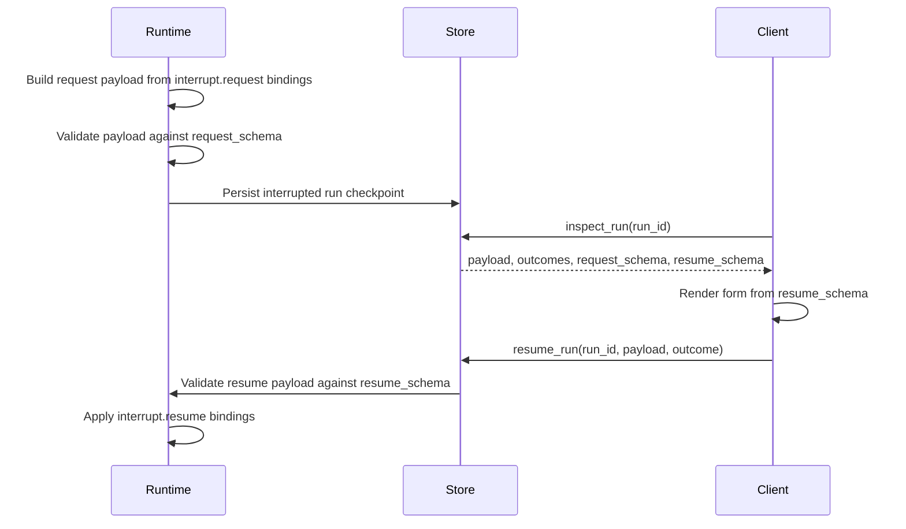

# Self-Describing Interrupt Contracts

Date: 2026-07-01

Status: Approved direction. Needs an executable implementation plan before code
changes.

Related:

- [Current roadmap](../../current_roadmap.md)
- [Persisted run/resume contract](2026-06-03-persisted-run-resume-contract.md)
- [Workflow console, agent demo, and defense presentation](2026-07-01-workflow-console-agent-demo.md)
- [Thesis system design](../../thesis/system-design-implementation.md)

## Purpose

Make human-in-the-loop workflow pauses self-describing. A client inspecting an
interrupted run should know:

- what kind of interrupt occurred;
- what payload was sent to the user;
- which resume outcomes are valid;
- what JSON shape a resume payload must have;
- how to validate the response before sending `resume_run`.

This is required for the Workflow Console and useful for CLI, JSON-RPC, MCP, and
agent clients. It prevents every client from needing workflow-specific code just
to render and answer an approval step.

## Current Gap

The current core interrupt model has useful mechanics but not a complete public
contract.

- `InterruptNode` stores `kind`, request bindings, resume bindings, and resume
  outcomes.
- Runtime builds an `InterruptRequest` with id, frame id, node id, kind,
  payload, route, and resumability.
- `workflow.runs.inspect` serializes the current runtime interrupt request.
- Resume validates the selected outcome against `InterruptNode.outcomes` and
  applies resume bindings.

What is missing is a machine-readable schema for the request payload and resume
payload. A client can see data, but it cannot know whether the response should
be `{ "approved": true }`, `{ "selected_issue_ids": [...] }`, or something else
without reading workflow code or challenge-specific docs.

This is close to the LangGraph-style `interrupt(value)` and `Command(resume=...)`
pattern: flexible and simple, but the response contract is mostly app
convention. `wf` should keep the flexibility while making the contract explicit.

## Design Summary

Add JSON Schema contracts to interrupt nodes and carry them through persisted run
inspection and resume validation.



## Core Model

Extend `InterruptNode` with two optional schema fields:

```python
class InterruptNode(BaseModel):
    id: str
    type: Literal["interrupt"]
    kind: str
    request: list[InputBinding] = Field(default_factory=list)
    resume: list[OutputBinding] = Field(default_factory=list)
    outcomes: list[str] = Field(default_factory=lambda: ["submitted"])
    request_schema: JsonSchemaObject = Field(default_factory=_object_schema)
    resume_schema: JsonSchemaObject = Field(default_factory=_object_schema)
```

The default schema is a permissive object schema:

```json
{
  "type": "object",
  "additionalProperties": true
}
```

This preserves existing persisted workflow documents and current examples. New
authoring helpers should emit explicit schemas whenever they can.

## Runtime Request Contract

When an interrupt node executes:

1. Build the request payload using existing `request` bindings.
2. Validate the built payload against `request_schema`.
3. If validation fails, fail the run with a structured execution error. This is
   a workflow contract bug, not a human pause.
4. Persist the interrupted run with an `InterruptRequest` that includes:
   - interrupt id;
   - frame id;
   - node id;
   - kind;
   - payload;
   - resumable flag;
   - child interrupt route when present;
   - outcomes;
   - request schema;
   - resume schema;
   - `typed=true` when the schema was explicitly declared.

The runtime should not infer request schemas from payload values. Inference
would make the public contract depend on one execution instance rather than the
workflow definition.

## Resume Contract

Before mutating run state, `resume_run` validates:

1. the run is currently interrupted;
2. the selected resume outcome is declared by the interrupt node;
3. the resume payload satisfies the interrupt node's `resume_schema`.

Only after those checks pass should the runtime apply `resume` bindings and
advance the graph. Invalid resume payloads must not consume the interruption or
write partial state changes.

Resume validation should use the same JSON Schema validation helper used by
workflow validation where possible. Do not hand-roll schema validation.

## Public Inspect Shape

`workflow.runs.inspect` should expose the interrupt contract directly:

```json
{
  "status": "interrupted",
  "interrupt": {
    "id": "interrupt:review",
    "frame_id": "frame_1",
    "node_id": "review",
    "kind": "issue_review",
    "payload": {
      "report_markdown": "# lda.chat Thesis And Project Readiness Report",
      "proposed_issues": []
    },
    "outcomes": ["submitted", "cancelled"],
    "request_schema": {
      "type": "object",
      "properties": {
        "report_markdown": {"type": "string"},
        "proposed_issues": {"type": "array"}
      },
      "required": ["report_markdown", "proposed_issues"]
    },
    "resume_schema": {
      "type": "object",
      "properties": {
        "approved": {"type": "boolean"},
        "selected_issue_ids": {
          "type": "array",
          "items": {"type": "string"}
        },
        "comment": {"type": "string"}
      },
      "required": ["approved", "selected_issue_ids"],
      "additionalProperties": false
    },
    "typed": true,
    "resumable": true
  }
}
```

The schema snapshot is part of the interrupted run's public contract. A client
should not need to reload the mutable artifact or inspect Python source code to
answer the interrupt.

## Authoring Contract

Raw workflow plans may specify `request_schema` and `resume_schema` directly on
interrupt nodes.

Authoring helpers may provide convenience wrappers:

- direct JSON Schema dictionaries;
- Pydantic models converted through `model_json_schema()`;
- a small built-in helper for common approval forms.

The stored workflow should still contain ordinary JSON Schema dictionaries.
Python type objects must not leak into persisted artifacts.

The first planned demo uses:

- `kind="issue_review"`;
- a request schema containing rendered report markdown and proposed issues;
- a resume schema containing approval, selected issue ids, and optional comment;
- outcomes `submitted` and `cancelled`.

## Validation Contract

Workflow validation should catch static interrupt contract errors:

- `request_schema` and `resume_schema` must be valid JSON Schema documents;
- schemas must describe JSON objects for V1;
- request binding targets must be valid local payload paths;
- resume binding sources must be valid local payload paths;
- resume binding destinations must write to declared state fields;
- every declared resume outcome that is routed must be known by the node.

V1 does not need full static proof that every request binding output satisfies
`request_schema`. Runtime validation still protects execution. Static validation
can become stricter later if it remains useful and maintainable.

## CLI And RPC Behavior

CLI and RPC should surface schema failures as ordinary structured product
errors, not Python tracebacks.

Recommended behavior:

- `wf run inspect <run_id>` includes the interrupt schemas in JSON output.
- Compact/text output summarizes `kind`, valid outcomes, and required resume
  fields.
- `wf run resume <run_id> --input ...` validates before mutation and reports
  missing/invalid resume fields.
- `wf explain` gains cards for interrupt request-schema and resume-schema
  validation failures if new diagnostic codes are added.

## Compatibility

Existing workflows without explicit schemas remain valid.

- Missing `request_schema` or `resume_schema` is treated as a permissive object
  schema.
- Public inspect can include `typed=false` for legacy interrupts.
- New authoring helpers and examples should emit explicit schemas.
- No migration is required for stored artifacts.

Compatibility here is justified because raw workflow plans and saved artifacts
are a documented external/persisted contract.

## Workflow Console Usage

The Workflow Console uses this contract to render generic human approval forms:

1. inspect the interrupted run;
2. read `interrupt.kind` and `interrupt.resume_schema`;
3. choose a kind-specific renderer when available;
4. fall back to a generic JSON Schema form;
5. validate locally for user feedback;
6. send the resume payload through JSON-RPC;
7. display server-side validation errors if the schema check still fails.

The console may provide a custom renderer for `issue_review`, but the custom
renderer must still emit a payload accepted by `resume_schema`.

## Non-Goals

- New interrupt execution semantics.
- Multi-user approval workflow.
- Authentication, authorization, or audit identity.
- Scheduling or event-triggered resumes.
- A full JSON Schema UI standard.
- Semantic compatibility analysis between schema revisions.
- LangGraph API compatibility.

## Implementation Slices

1. Extend core models and persistence-safe serialization.
2. Validate request and resume schemas using the existing schema validation
   library path.
3. Carry interrupt schemas and outcomes into `InterruptRequest` and
   `workflow.runs.inspect`.
4. Validate resume payloads before state mutation.
5. Add authoring/builder helpers and schema discovery output.
6. Update CLI docs, skills, and examples.
7. Add the `issue_review` interrupt to the prepared `lda.chat` report workflow.

## Test Plan

- Core model accepts explicit schemas and defaults legacy nodes.
- Invalid interrupt schemas are rejected by workflow validation.
- Runtime validates a request payload before persisting interruption.
- Resume rejects invalid payloads without mutating run state.
- Resume rejects unknown outcomes before mutating run state.
- `workflow.runs.inspect` includes schemas, outcomes, typed flag, and payload.
- JSON-RPC and CLI resume return structured errors for invalid payloads.
- Draft/raw-plan compilation preserves interrupt schemas.
- Builder/Pydantic convenience emits plain JSON Schema in saved workflows.

## Success Criteria

The contract is complete when an external client can inspect an interrupted run,
render a correct form, submit a valid resume payload, and explain invalid
responses without reading workflow source code or hard-coding that workflow's
interrupt shape.
