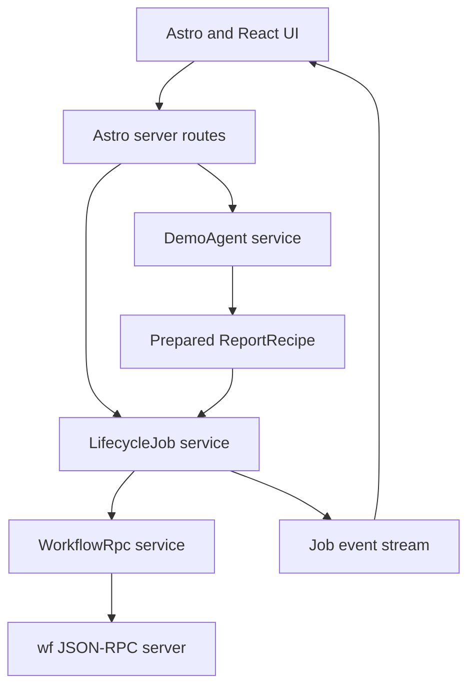
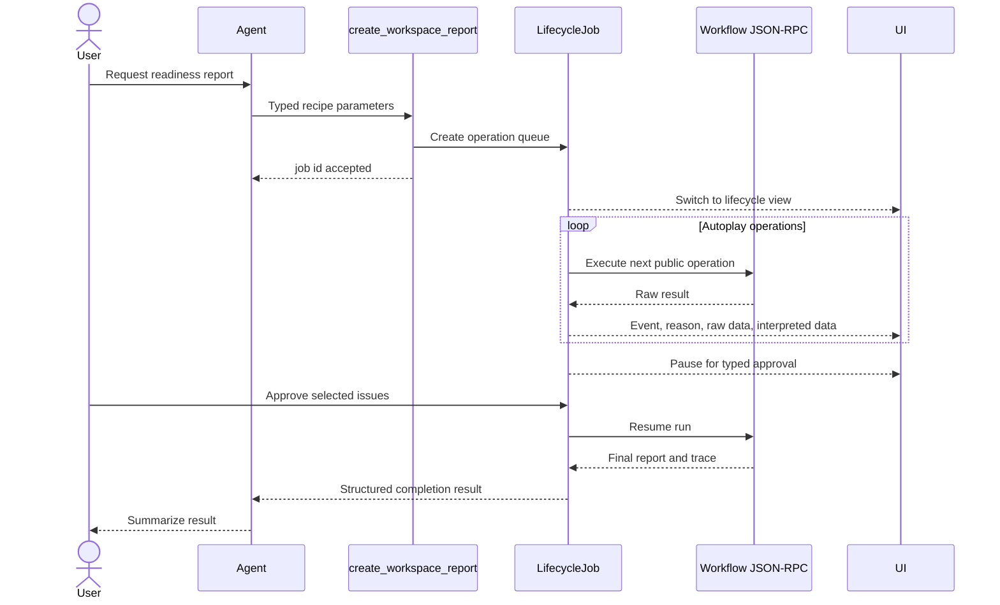
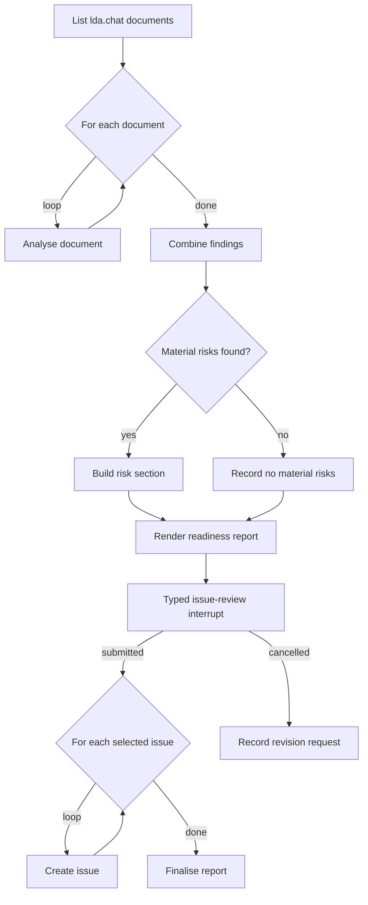

# Workflow Console, Agent Demo, And Defense Presentation

Date: 2026-07-01

Status: Approved direction. Implementation is split into prerequisite slices.

Related:

- [Current roadmap](../../current_roadmap.md)
- [Workflow API architecture](../../wf_api_architecture.md)
- [Persisted run/resume contract](2026-06-03-persisted-run-resume-contract.md)
- [Self-describing interrupt contracts](2026-07-01-self-describing-interrupt-contracts.md)
- [Thesis system design](../../thesis/system-design-implementation.md)

## Purpose

Build one local-first web application that serves three related needs:

1. a reusable Workflow Console for inspecting a running `wf` JSON-RPC server;
2. a reliable defense demonstration of the complete workflow lifecycle;
3. a compact thesis presentation with live-demo and recorded-replay routes.

The application also demonstrates where an agent belongs in the product. A
constrained agent translates a natural-language request into typed parameters
for a prepared recipe. The workflow substrate remains responsible for drafts,
artifacts, deployments, runs, interrupts, traces, validation, and source
bindings.

The demo agent is an integration client, not new evidence for general agent
planning ability. The audited challenge campaign remains the evidence for how
generic external agents interact with the public product surface.

## Product Boundary

Create a top-level `web/` package rather than putting product code under
`docs/presentation/`.

```text
web/
  package.json
  astro.config.mjs
  src/
    pages/
      connect.astro
      console/
      demo/
      replay/
      presentation/
      appendix/
    components/
      agent/
      lifecycle/
      rpc/
      trace/
      workflow-graph/
      presentation/
```

The first release is a local-development Workflow Console. It is not a
production admin panel and does not claim authentication, authorization,
multi-user administration, or safe access to arbitrary remote servers.

## System Architecture



All workflow operations use the existing public JSON-RPC API. No Python-side
demo endpoint, direct store mutation, or privileged workflow path is added.

The web app should not shell out to `wf` for normal operation. The CLI is an
operator frontend: it resolves config, parses files and flags, formats output,
and sometimes aggregates several calls for human convenience. The console needs
the lower-level JSON-RPC request/response stream so it can show exact protocol
evidence, avoid shell quoting and encoding failures, and keep raw calls aligned
with interpreted UI state.

## TypeScript And Effect Boundary

Use Effect for server-side orchestration and protocol handling:

- `Schema` decodes JSON-RPC envelopes and selected result projections;
- services and `Layer`s provide connection configuration, RPC, recipes, jobs,
  replay storage, and the model gateway;
- tagged errors distinguish connection, protocol, decoding, workflow,
  timeout, and demo-state failures;
- `SubscriptionRef` or `Stream` publishes lifecycle events;
- scoped fibers run and cancel autoplay;
- timeouts and retries apply only where semantically safe.

Do not spread Effect through every React component. React components consume
ordinary view models and event streams. Astro route handlers are the
`Effect.runPromise` boundary.

Mutation calls such as artifact creation, deployment saving, run start, and
resume are never retried blindly. Health and idempotent read calls may use a
small bounded retry policy.

## Connection Model

The connection page accepts a JSON-RPC URL such as
`http://127.0.0.1:8765/rpc`.

1. The Astro server validates the URL.
2. The first slice accepts only loopback hosts.
3. `workflow.health` verifies the endpoint.
4. The connection is retained for the browser session.
5. Astro proxies JSON-RPC calls server-side to avoid browser CORS coupling.
6. Every call records its raw request, raw response, interpreted result,
   duration, and equivalent CLI command.

Allowing arbitrary remote targets would turn the proxy into an SSRF surface and
requires a separate security design.

## JSON-RPC Method Registry

Represent mapped operations declaratively. Each entry contains:

- JSON-RPC method name;
- Effect schema for parameters and selected result fields;
- human explanation;
- equivalent CLI formatter;
- interpretation function;
- mutation/idempotency classification.

The initial read surface maps:

- `workflow.health`;
- source list, inspect, and diagnose;
- capability list and inspect;
- draft-workspace list, get, validate, and compile;
- artifact list and inspect;
- deployment list, inspect, and validate;
- run list, inspect, and trace.

The prepared demo additionally maps:

- draft-workspace create from capability and patch;
- draft validation and compilation;
- artifact creation from a workspace;
- deployment save and validation;
- run start, inspect, trace, and resume.

Mapping a method does not grant special authority. The Workflow Console and the
prepared demo are ordinary users of the same registry.

## Workflow Console

The first console is read/inspect-focused. It provides:

- source and capability inventory;
- draft workspace list, graph, revision, and diagnostics;
- artifact versions and required source bindings;
- deployment binding and readiness state;
- run status, output, interrupt, and bounded trace;
- raw JSON-RPC request/response drawers.

Generic visual workflow editing is not part of the first initiative. The
prepared demo performs controlled mutations through the same public RPC
registry. A future editor can reuse the graph and inspector components.

## Visual Interaction Model

The UI uses focus modes instead of showing every panel simultaneously:

- **Lifecycle:** Draft, Artifact, Deployment, Run, and Trace records.
- **Graph:** interactive workflow graph with semantic zoom.
- **Execution:** active nodes and trace progression over the same graph.
- **Output:** rendered readiness report and created issues.
- **Raw:** collapsible JSON-RPC request and response drawer.

Use an interactive graph component, expected to be `@xyflow/react`, inside an
Astro React island. Static presentation diagrams remain Mermaid.

A small graph embedded in a lifecycle card can expand into the primary canvas.
Selecting a node opens a side drawer with capability, source, bindings,
outcomes, and trace data. Selecting a lifecycle record zooms back out.

## Lifecycle Job And Autoplay

The agent calls one macro tool. The macro creates a lifecycle job and returns a
job id. The TypeScript job then executes public JSON-RPC operations.



Autoplay:

- advances one operation at a time;
- allows Pause and Next;
- pauses automatically on errors, interrupts, and completion;
- never approves a human interrupt automatically;
- supports no backward step in live mode;
- supports previous, next, and timeline scrubbing in replay mode.

The chat collapses while the lifecycle and graph views carry the operation. It
returns after completion, when the agent summarizes the structured result.

## Attribution And Honesty

The UI distinguishes agent activity from orchestration activity.

- Agent card: `create_workspace_report({...})`.
- Orchestrator card: concrete JSON-RPC method, reason, equivalent CLI, raw
  response, and interpreted result.

Do not present orchestrated sub-operations as independent agent tool calls. Do
not present recorded text as a live model response. Replay mode is visibly
labeled.

## Demo Agent

The agent is intentionally constrained:

- one prepared report recipe;
- typed recipe parameters;
- one macro tool;
- no shell, repository reads, code search, or subagents;
- bounded output and timeout;
- replaceable model gateway;
- recorded replay fallback.

The first model gateway may use the OpenCode API directly, but the application
depends only on a `DemoAgent` service contract. Exact provider selection belongs
to the agent-integration slice.

The demo agent is not compared with the benchmark agents. Benchmark agents test
public-surface discovery and free-form operation; the demo agent illustrates a
product integration built on that surface.

## Prepared `lda.chat` Report Workflow

Create a separate example rather than expanding the existing minimal report
case study:

```text
examples/lda_report_workflow/
  documents/
    project-brief.md
    architecture-notes.md
    evaluation-findings.md
    risk-register.md
    roadmap.md
  document_source.py
  report_source.py
  issue_board_source.py
  workflow.plan.json
  run-input.json
  wf.config.json
```

Python sources:

- `local.lda_docs`: list and read deterministic project documents;
- `local.lda_report`: analyse documents, combine findings, classify risks,
  render, and finalise the report;
- `local.issue_board`: create, list, and reset local demo issues.

The issue board is JSON-backed with atomic writes. It is a deterministic local
demo source, not a production tracker.

Workflow shape:



The report is titled **lda.chat Thesis And Project Readiness Report** and covers
achievements, architecture status, evaluation evidence, material risks, and
next actions.

The interrupt request includes the rendered report and proposed issues. The
resume payload contains approval, selected issue ids, and an optional comment.
The UI selects all issues by default and allows individual deselection.

## Self-Describing Interrupt Dependency

Interrupted run inspection now exposes `kind`, payload, outcomes,
`request_schema`, `resume_schema`, and `typed`. Runtime validates request and
resume payloads against those contracts. The Workflow Console can therefore
render and validate arbitrary interrupts without reading workflow code.

The implemented contract is defined in
[Self-describing interrupt contracts](2026-07-01-self-describing-interrupt-contracts.md).

## Replay And Failure Handling

Every lifecycle event envelope records:

- operation id and stage;
- JSON-RPC method and parameters;
- raw response or error;
- interpreted result;
- equivalent CLI;
- reason and duration;
- resulting lifecycle ids.

Recorded mode replays these same envelopes. Live failure offers a visible switch
to the matching recording. The presentation does not restart in a different UI
or hide the failure.

## Defense Presentation

The defense has 15 minutes of presentation and 15 minutes of questions. Target
9-10 slides and no more than three minutes of live demo.

Routes:

- `/presentation`: primary slides;
- `/demo`: live agent and lifecycle presenter;
- `/replay`: recorded fallback;
- `/appendix`: backup architecture, evaluation, and implementation slides.

The presentation transitions directly into the demo and back. The exact slide
library is selected in the presentation slice; the route and shared component
boundaries are fixed by this design.

## Implementation Order

1. Self-describing interrupt request/resume contracts.
2. Deterministic `lda.chat` report workflow and Python sources.
3. `web/` Astro and Effect foundation, connection flow, and RPC registry.
4. Workflow Console read/inspect views, graph, trace, and raw drawers.
5. Lifecycle job, autoplay, typed approval, issue board, and replay.
6. Constrained demo agent and replaceable model gateway.
7. Defense presentation and appendix routes.

Each slice gets its own executable implementation plan. Do not combine the
Python contract change, web foundation, agent integration, and presentation
into one implementation pass.

## Non-Goals

- Production authentication or authorization.
- Arbitrary remote RPC proxying.
- A general visual workflow editor.
- Scheduling or event triggers.
- Google Drive, email, or other external service dependencies.
- Free-form autonomous workflow synthesis in the live defense demo.
- Treating the demo agent as benchmark evidence.

## Success Criteria

The initiative is complete when:

1. a local user can connect the console to a loopback workflow RPC server;
2. lifecycle records and traces are readable without scrolling raw JSON;
3. raw request/response evidence remains available beside interpretation;
4. the prepared recipe runs through draft, artifact, deployment, run,
   interrupt, resume, issue creation, output, and trace;
5. interrupt forms are generated from public contracts;
6. live and replay modes render the same event model;
7. the constrained agent invokes one macro tool and receives the final result;
8. the three-minute demo has a tested replay fallback;
9. the presentation explains the agent/substrate boundary without overstating
   autonomous planning.
