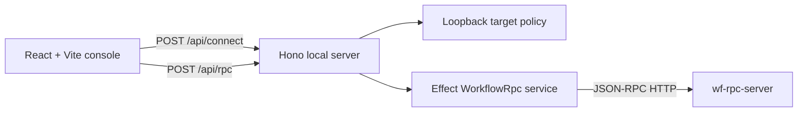

# Workflow Console Foundation Design

Date: 2026-07-01

Status: Implemented. First web slice complete.

Related:

- [Workflow console, agent demo, and defense presentation](2026-07-01-workflow-console-agent-demo.md)
- [Self-describing interrupt contracts](2026-07-01-self-describing-interrupt-contracts.md)
- [Workflow API architecture](../../wf_api_architecture.md)
- [Current roadmap](../../current_roadmap.md)

## Goal

Create the first executable `web/` slice for lda.chat: a local React console
that connects to a loopback `wf-rpc-server` through a small Node proxy, proves
typed JSON-RPC decoding with Effect, and presents both interpreted connection
state and raw protocol evidence.

This slice establishes durable package and protocol boundaries. It does not
build lifecycle browsing, workflow graphs, autoplay, replay, the demo agent, or
the defense presentation.

## Architecture Decision

Use an app-first React architecture rather than Astro as the primary console
shell:

- Vite builds and serves the React development application.
- Hono provides the local Node HTTP server and production static-file host.
- Effect owns URL validation, JSON-RPC schemas, typed errors, and upstream RPC
  execution.
- React consumes plain view models and never runs Effect programs directly.
- Astro remains available for a later static presentation application and is
  not a dependency of the console.

The Hono server is not a second workflow API. It is a narrow browser-facing
adapter over the existing public JSON-RPC endpoint.



## Workspace Layout

Create a pnpm workspace under the existing repository root:

```text
web/
  package.json
  pnpm-lock.yaml
  pnpm-workspace.yaml
  tsconfig.base.json
  apps/
    console/
      package.json
      index.html
      vite.config.ts
      src/
        app/
        components/
        connection/
        rpc/
        styles/
        main.tsx
    server/
      package.json
      src/
        app.ts
        index.ts
        static.ts
  packages/
    rpc/
      package.json
      src/
        errors.ts
        method-registry.ts
        protocol.ts
        service.ts
        target-policy.ts
        index.ts
```

The first slice creates only `console`, `server`, and `rpc`. Later slices may
add:

```text
web/apps/presentation/   # Astro presentation and appendix routes
web/packages/ui/         # shared components after real reuse exists
```

Do not create empty placeholder packages for future work.

The root package pins `pnpm@11.3.0`. The supported runtime is Node.js 22 or
newer; the current development environment uses Node.js 26.

## Process Model

Development uses two processes started through one root command:

1. Vite serves the React application with hot reload.
2. Hono serves `/api/*` and proxies validated JSON-RPC calls.

Vite forwards `/api/*` to Hono during development. The browser therefore uses
one apparent origin and does not depend on Python CORS configuration.

Production uses one Hono process:

1. Vite builds static assets.
2. Hono serves the Vite output.
3. Hono retains the same `/api/*` routes.
4. Unknown non-API paths fall back to `index.html` for client routing.

The first slice does not start or supervise `wf-rpc-server`. Operators run it
separately and paste its loopback JSON-RPC URL into the console.

## Connection Contract

The connection form accepts a URL such as:

```text
http://127.0.0.1:8765/rpc
```

Accepted targets must satisfy all rules:

- scheme is `http`;
- hostname is exactly `127.0.0.1`, `localhost`, or `[::1]`/`::1` after URL
  parsing;
- username and password are absent;
- port is explicit and in the valid TCP port range;
- URL has no query string or fragment;
- redirects are not followed by the upstream fetch;
- the normalized URL is validated again for every proxy request.

`POST /api/connect` accepts:

```json
{
  "target": "http://127.0.0.1:8765/rpc"
}
```

It sends `workflow.health` with an empty params object and returns a view model:

```json
{
  "ok": true,
  "connection": {
    "status": "connected",
    "target": "http://127.0.0.1:8765/rpc",
    "serverStatus": "ok",
    "durationMs": 12
  },
  "exchange": {
    "request": {},
    "response": {}
  }
}
```

The exact raw JSON-RPC request and response are retained inside `exchange`.
They are omitted from the compact connection card but available in the raw
drawer.

The browser stores only the normalized target URL in `sessionStorage`. The
server remains stateless: every `/api/rpc` request carries the target and is
validated again. No cookies, server sessions, authentication tokens, or target
registry are introduced in this slice.

## JSON-RPC Contract

The RPC package defines Effect schemas for:

- JSON-RPC request envelopes;
- success response envelopes;
- error response envelopes;
- `workflow.health` results;
- `workflow.sources.list` parameters and the selected result fields required by
  the first console screen.

The request id is generated by the server adapter and represented as a string.
Responses must have `jsonrpc: "2.0"`, the matching id, and exactly one of
`result` or `error`.

The first method registry contains two entries:

```text
workflow.health
workflow.sources.list
```

Each registry entry includes:

- method name;
- parameter schema;
- result schema;
- human label and explanation;
- idempotency classification;
- equivalent CLI formatter;
- result-to-view-model interpreter.

Unknown methods are rejected by the Hono adapter. This is a mapped console
surface, not an unrestricted arbitrary JSON-RPC relay.

## Server API

The first Hono application exposes:

- `GET /api/health`: confirms the web server itself is running;
- `POST /api/connect`: validates a target and calls `workflow.health`;
- `POST /api/rpc`: invokes one registered read-only JSON-RPC operation;
- static Vite assets and SPA fallback in production.

`POST /api/rpc` accepts:

```json
{
  "target": "http://127.0.0.1:8765/rpc",
  "operation": "workflow.sources.list",
  "params": {}
}
```

It returns:

```json
{
  "ok": true,
  "operation": "workflow.sources.list",
  "label": "List sources",
  "interpreted": {},
  "exchange": {
    "request": {},
    "response": {}
  },
  "equivalentCli": "uv run wf source list",
  "durationMs": 8
}
```

The server accepts only registry operations. It does not accept a raw method
string supplied directly by the browser.

Failures use one browser-facing shape:

```json
{
  "ok": false,
  "error": {
    "code": "upstream_unreachable",
    "message": "Could not connect to the workflow RPC server."
  },
  "exchange": {
    "request": {},
    "response": null
  }
}
```

HTTP status mapping is fixed:

- `400`: invalid target, unknown operation, or invalid browser request;
- `502`: upstream connection, JSON-RPC remote, protocol, or decode failure;
- `504`: upstream timeout.

An upstream JSON-RPC error remains visible in the raw exchange but is mapped to
a safe browser-facing code and message.

## Effect Boundary

Effect is confined to `web/packages/rpc` and the Hono handler boundary.

Services:

- `TargetPolicy`: parse and validate loopback RPC targets;
- `WorkflowRpc`: execute one registered JSON-RPC call;
- `MethodRegistry`: resolve operation metadata and schemas;
- `Clock` through Effect for measured duration and deterministic tests.

Tagged errors:

- `InvalidTargetError`;
- `UnknownOperationError`;
- `UpstreamConnectionError`;
- `UpstreamTimeoutError`;
- `RpcProtocolError`;
- `RpcRemoteError`;
- `RpcDecodeError`.

Hono handlers call `Effect.runPromise` once per request and map tagged errors to
stable HTTP responses. React receives JSON DTOs and ordinary discriminated
unions, not Effect values, causes, layers, or services.

No retries are applied in this slice. Even health and list operations should
report the first real failure so connection diagnostics remain honest.

## Console UI

The first page has three regions:

1. **Connection header**: target URL, connect/reconnect action, connection
   status, server status, and measured duration.
2. **Source inventory**: a compact read-only list produced by
   `workflow.sources.list` after connection succeeds.
3. **Protocol evidence**: a collapsible drawer showing the selected operation,
   equivalent CLI, raw request, raw response, and any typed error.

The UI must distinguish:

- not configured;
- connecting;
- connected;
- invalid target;
- unreachable server;
- JSON-RPC remote error;
- malformed response.

Connection failures keep the entered URL editable. Reconnect replaces the
session target only after a successful health call. Reload restores the last
successful target from `sessionStorage` but does not silently call it until the
user reconnects.

The first slice uses React local state and reducers. Do not add Redux, Zustand,
Pinia, XState, TanStack Query, or a client Effect runtime before lifecycle data
creates a demonstrated need.

## Visual Direction

The console should look like an operational instrument, not a generic admin
template:

- warm off-white workspace background with a subtle technical grid;
- ink, slate, signal green, amber, and red tokens;
- expressive condensed heading face paired with a readable technical body
  face;
- dense but calm source rows;
- raw evidence presented as an intentional inspection surface, not a debug
  afterthought;
- desktop-first layout that remains usable on a narrow laptop or tablet.

Avoid dark-mode-first styling, purple gradients, interchangeable dashboard
cards, and motion without semantic purpose. The first meaningful animation is
the connection transition and staggered source reveal.

## Error And Security Boundaries

- The proxy never forwards non-loopback URLs.
- Upstream redirects are rejected rather than followed.
- Browser request bodies are limited to 256 KiB.
- Upstream response bodies are limited to 4 MiB.
- Upstream calls have a five-second timeout and abort signal.
- Raw evidence is JSON-serialized and rendered as text, never inserted as HTML.
- Hono error responses contain a stable error code and safe message; stack
  traces remain server-side.
- The app binds to loopback by default.
- This slice does not claim authentication or protection from other local
  processes running as the same user.

## Testing Strategy

Use Vitest for all TypeScript tests and React Testing Library for component
behavior.

Required tests:

- target policy accepts the three loopback host forms and rejects remote,
  credentialed, query, fragment, implicit-port, and redirect targets;
- JSON-RPC schemas accept valid success/error envelopes and reject mismatched
  ids or malformed envelopes;
- method registry exposes only health and source-list operations;
- Hono connect route returns interpreted and raw health data through an injected
  fake upstream fetch;
- Hono RPC route rejects unknown operations before any fetch;
- Hono maps timeout, connection, remote RPC, and decode failures to stable error
  DTOs;
- React connection form preserves failed input and persists only successful
  normalized targets;
- source inventory renders interpreted source rows;
- raw evidence drawer exposes request, response, and equivalent CLI;
- production build completes and the Hono static fallback serves the console.

Do not require a live Python server in the default frontend test suite. Add a
documented optional smoke command against:

```powershell
uv run wf-rpc-server --config wf.config.json --host 127.0.0.1 --port 8765
```

## First-Slice Success Criteria

The foundation slice is complete when:

1. `pnpm --dir web install`, test, typecheck, and build commands are documented
   and pass;
2. one root development command starts Vite and Hono;
3. a user can enter a loopback RPC URL and receive interpreted
   `workflow.health` state;
4. a connected user can list workflow sources;
5. every displayed operation has raw request/response evidence and an
   equivalent CLI string;
6. unknown methods and non-loopback targets fail before upstream fetch;
7. the production Hono process serves the built React application;
8. no Python CORS change, direct store access, workflow mutation, graph UI,
   autoplay, replay, or agent integration is included.

## Deferred Slices

After this foundation:

1. read-only lifecycle inspectors for drafts, artifacts, deployments, runs,
   traces, and graph rendering;
2. prepared lifecycle job, autoplay, typed interrupt form, issue-board output,
   and replay;
3. constrained demo agent and recipe macro;
4. Astro presentation and appendix app consuming shared React components only
   where interactivity is useful.
