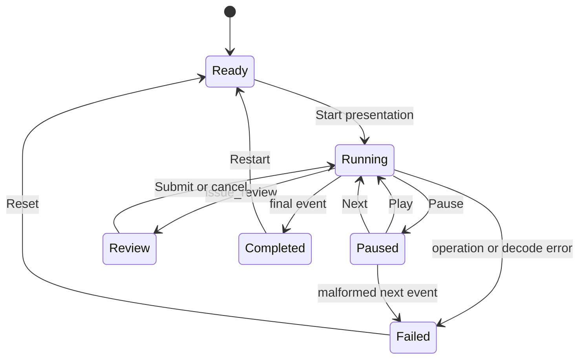

# Demo Autoplay And Replay

## Status

Current design contract for the next Workflow Console slice.

## Related Designs

- [Workflow console, agent demo, and defense presentation](2026-07-01-workflow-console-agent-demo.md)
- [Workflow console lifecycle explorer](2026-07-02-workflow-console-lifecycle-explorer.md)
- [Self-describing interrupt contracts](2026-07-01-self-describing-interrupt-contracts.md)

## Purpose

The prepared `lda_report_workflow` now works through the console, but its
controls expose implementation actions rather than a coherent presentation
sequence. The defense also needs a deterministic fallback when the live RPC
server, model provider, or local environment fails.

This slice turns the working demo into a lifecycle timeline with two modes:

- **Live** executes public JSON-RPC operations and records normalized events.
- **Replay** reads one committed, reviewed recording and renders the same event
  stream without contacting the workflow server.

The timeline replaces the prominent refresh/start controls with a presentation
flow: Start, Pause, Next, Continue at the human interrupt, and Restart.

## Scope

The slice includes:

- a normalized demo event envelope;
- a deterministic timeline state machine;
- stepwise live execution of the prepared deployment;
- Play, Pause, Next, Continue, and Restart controls;
- automatic pause on `issue_review`, errors, and completion;
- capture of live public-RPC evidence into timeline events;
- one committed canonical recording;
- replay of that recording through the same view components;
- visible mode and replay attribution.

The slice does not include:

- an LLM or demo-agent integration;
- workflow authoring or deployment setup inside the UI;
- Astro routes or presentation slides;
- backward stepping in live mode;
- automatic approval of an interrupt;
- arbitrary recording import or editing;
- persistence of ad-hoc recordings outside the browser session.

## Product Boundary

The UI remains an ordinary client of the public JSON-RPC surface. Live mode
uses the existing console backend and operation registry. Replay mode does not
claim that recorded operations are live. It is labeled visibly and does not
contact the workflow server.

The prepared deployment remains external to the console:

```text
lda_report_case_study.default
```

If it is absent in live mode, the existing missing-deployment instructions are
shown. Replay mode remains available because it does not depend on the store.

## Architecture

The slice introduces four focused units under
`web/apps/console/src/demo/timeline/`:

```text
timeline/
  models.ts             # Event and recording schemas/types
  reducer.ts            # Pure timeline state machine
  live.ts               # Live operation queue and event capture
  replay.ts             # Canonical recording loader
  useDemoTimeline.ts    # React adapter around live/replay controllers
```

The existing `LdaReportDemoPanel` remains responsible for report, issue, and
interrupt presentation. It consumes a timeline controller instead of owning
the operation sequence directly.

The existing `useLdaReportDemo` operation logic is either moved into `live.ts`
or reduced to a thin compatibility adapter. There must be only one owner of the
live sequence.

## Demo Event Envelope

Every visible lifecycle action uses one normalized event shape:

```ts
type DemoEventStage =
  | "deployment_check"
  | "run_start"
  | "interrupt"
  | "run_resume"
  | "trace_read"
  | "completed"
  | "failed";

type DemoEvent = {
  readonly id: string;
  readonly sequence: number;
  readonly stage: DemoEventStage;
  readonly operation: string | null;
  readonly reason: string;
  readonly equivalentCli: string | null;
  readonly params: unknown;
  readonly rawResponse: unknown;
  readonly interpreted: unknown;
  readonly durationMs: number;
  readonly resultingIds: {
    readonly deploymentId: string | null;
    readonly runId: string | null;
  };
  readonly recordedAt: string;
};
```

Synthetic presentation events such as `interrupt`, `completed`, and `failed`
may have `operation: null`. They identify a state transition derived from a
real operation result; they are not presented as agent or RPC calls.

Event ids are stable inside a recording. The committed recording uses fixed
ids and timestamps. Live events may derive ids from the sequence and current
run id; they must not rely on `Date.now()` alone.

## Recording Contract

A recording contains metadata and an ordered event list:

```ts
type DemoRecording = {
  readonly schemaVersion: 1;
  readonly recordingId: string;
  readonly title: string;
  readonly createdAt: string;
  readonly deploymentId: "lda_report_case_study.default";
  readonly source: "reviewed_live_capture";
  readonly events: ReadonlyArray<DemoEvent>;
};
```

The canonical recording is committed at:

```text
web/apps/console/src/demo/recordings/lda-report-success.v1.json
```

The recording must contain no machine-specific paths, credentials, session
tokens, or unrelated store contents. Raw request and response fields are kept
only for the prepared demo operations. The recording is decoded with Valibot
before use; malformed recordings fail visibly rather than partially rendering.

The reviewed recording covers:

1. deployment inspection;
2. run start;
3. `issue_review` interrupt;
4. submitted resume with at least one selected issue;
5. final trace read;
6. completed report and created issue output.

## Timeline State Machine



Timeline state contains:

```ts
type DemoTimelineState = {
  readonly mode: "live" | "replay";
  readonly phase:
    | "ready"
    | "running"
    | "paused"
    | "review"
    | "completed"
    | "failed";
  readonly events: ReadonlyArray<DemoEvent>;
  readonly cursor: number;
  readonly autoplay: boolean;
  readonly error: string | null;
};
```

`cursor` is an internal playback-position example, not a persisted recording
field or public UI contract. An implementation may instead keep the current
event id, split pending/applied event arrays, or derive a stage-to-position map.
Presentation meaning always comes from the ordered event and its `stage`, not
from a magic numeric value.

Invariants:

- `cursor` is the index of the last applied event, or `-1` before playback.
- Replay may move only forward in this slice. Timeline scrubbing remains a
  later presentation refinement.
- Live mode cannot apply an event before its RPC operation completes.
- Pause stops before executing the next operation; it does not cancel an RPC
  already in flight.
- `issue_review` always enters `review` and disables Play/Next until the user
  submits or cancels.
- Completion and failure stop autoplay.
- Restart clears transient live state and returns to `ready` without deleting
  persisted runs or issue-board records.

## Live Mode

Live mode uses a small explicit operation queue:

```text
workflow.deployments.inspect
workflow.runs.start
pause for issue_review
workflow.runs.resume
workflow.runs.trace
```

Each queue step declares:

- operation name;
- why the operation is performed;
- parameter builder from current live context;
- result decoder;
- event builder;
- next stage.

The executor performs one step at a time. Autoplay schedules the next step only
after the current event has been recorded and rendered. `Next` performs exactly
one eligible step. Mutation operations are never retried automatically.

The live executor records failed operation evidence as a `failed` event before
entering the failed phase. Missing deployment remains a specific recoverable
failure with the existing setup instructions.

## Replay Mode

Replay loads and decodes the canonical recording when selected. It does not
call `connectToServer()` or `callOperation()` for timeline playback.

Replay timing is presentation timing, not the original network timing:

- default delay between ordinary events: 900 ms;
- transition to review: immediate after the interrupt event;
- completion: immediate after the final event;
- Pause and Next use the same reducer actions as live mode.

The UI displays a persistent `Recorded replay` label. The evidence inspector may
show the recording's stored request and response, but must also identify the
recording id.

The human approval remains interactive in replay mode. The replay recording
contains the reviewed submitted branch; selecting Continue advances through
that branch. The UI must not imply that replay choices alter the stored
recording or create real issues.

## Controls

The primary controls are:

- mode selector: `Live` / `Replay`;
- `Start presentation` in ready state;
- `Pause` while autoplay is running;
- `Play` while paused;
- `Next` while paused;
- `Continue` or `Cancel review` at the interrupt;
- `Restart` after completion;
- `Reset` after failure.

`Refresh demo state` is secondary live-mode recovery. It is hidden or disabled
while starting, interrupted, or resuming. It is not shown in replay mode.

The UI includes a compact timeline showing stage label, status, and the current
event. Raw payloads remain collapsed by default.

## Rendering

The timeline drives existing views:

- deployment check updates demo readiness;
- run start updates run id and interrupt payload;
- interrupt renders the existing issue selection form;
- resume renders created issues and final markdown;
- trace read renders the existing trace table;
- raw event data remains available through evidence details.

Live and replay must not fork into separate report or trace components. Mode
differences belong in controllers and attribution labels.

## Error Handling

Failures are typed at the controller boundary into these visible categories:

- prepared deployment missing;
- RPC transport or remote error;
- malformed interpreted run result;
- unexpected run state or interrupt kind;
- malformed canonical recording;
- trace unavailable after successful resume.

The timeline stops on every failure. It shows the failed operation, reason,
equivalent CLI when available, and raw evidence. It does not silently switch
from live mode to replay. The operator may choose replay explicitly.

## Testing

Unit tests cover:

- reducer transitions and invariants;
- Play, Pause, Next, Restart, and Reset;
- automatic pause at review/completion/failure;
- recording schema decoding;
- stable ordering and ids;
- replay performs no RPC calls;
- live Next performs one operation;
- live autoplay never crosses the interrupt;
- mutation calls are not retried;
- malformed recording and malformed RPC result failures.

Component tests cover:

- mode attribution;
- control availability by phase;
- timeline event rendering;
- interactive live interrupt;
- interactive replay interrupt without real mutation;
- completed markdown, issue, and trace rendering;
- missing deployment instructions in live mode.

Live browser smoke covers:

1. run the console against `examples/lda_report_workflow/wf.config.json`;
2. start live presentation;
3. confirm autoplay stops at `issue_review`;
4. select one issue and continue;
5. confirm completion, issue output, trace, and evidence;
6. restart in replay mode with the RPC server unavailable;
7. confirm the same visible story completes with a replay label.

## Success Criteria

The slice is complete when:

1. one primary control starts the prepared live story;
2. Play, Pause, and Next deterministically control progress;
3. autoplay never approves or crosses the human interrupt;
4. live operations produce normalized timeline events with evidence;
5. one reviewed recording is committed and schema-validated;
6. replay works with the RPC server unavailable;
7. live and replay use the same report, issue, trace, and evidence components;
8. mode attribution prevents recorded behavior from appearing live;
9. the complete sequence can be demonstrated in under three minutes.
