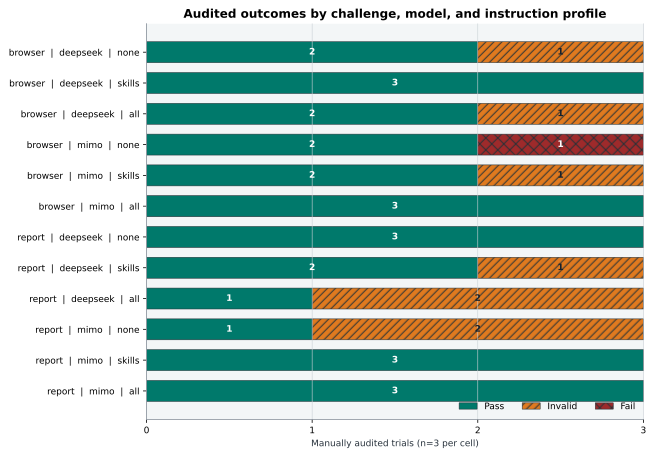
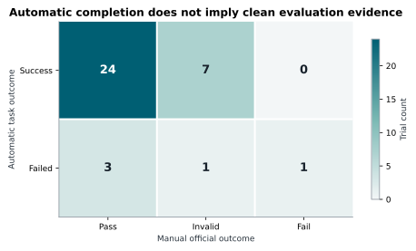
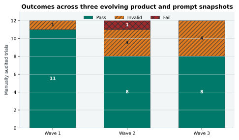
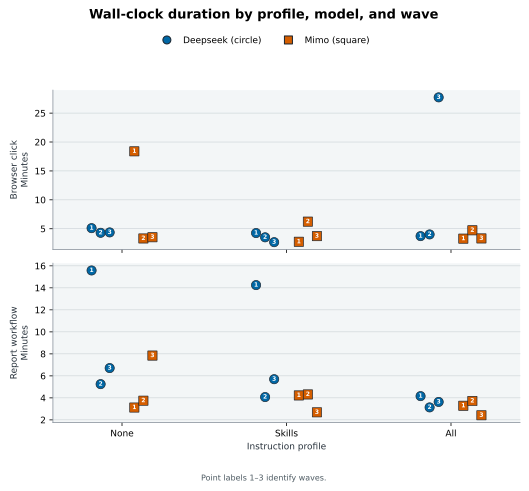
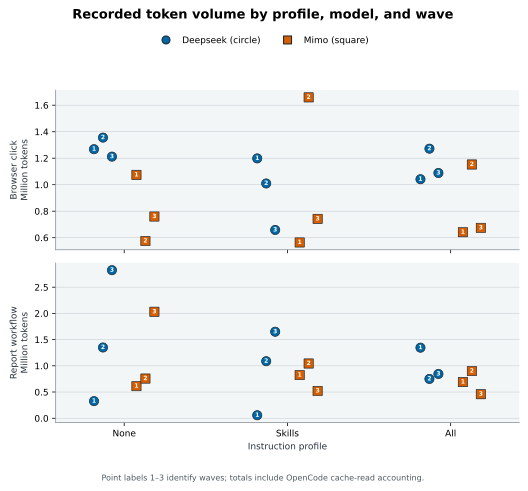

## Audited Agent Challenge Campaign

The primary campaign contains 36 manually audited trials: 27 clean product-path passes under the campaign rules, 8 invalid evaluation samples, and 1 failure. These counts are not a model-success-rate estimate.

The campaign crosses two challenges × two hosted models × three instruction profiles (`none`, `skills`, and `all`) = 12 cells, with three repetitions per cell (n=3). The checked cohort snapshot records report hashes, prompt hashes, the repository commit, automatic metrics, and manual-audit outcomes; local raw report files are verified against those hashes when present.

Because repository snapshots and one prompt rule changed between waves, this is longitudinal engineering evidence, not a controlled model comparison.

> **Campaign validity note.** This campaign is a bounded longitudinal audit, not a controlled comparison. Each cell has n=3; waves changed product and prompt snapshots; all audits were performed by the author.

Selection rule: The latest three completed, manually audited trials per challenge, model, and instruction profile as of 2026-06-30.

| Challenge / model / profile | Pass | Invalid | Fail |
| --- | ---: | ---: | ---: |
| browser / deepseek / none | 2 | 1 | 0 |
| browser / deepseek / skills | 3 | 0 | 0 |
| browser / deepseek / all | 2 | 1 | 0 |
| browser / mimo / none | 2 | 0 | 1 |
| browser / mimo / skills | 2 | 1 | 0 |
| browser / mimo / all | 3 | 0 | 0 |
| report / deepseek / none | 3 | 0 | 0 |
| report / deepseek / skills | 2 | 1 | 0 |
| report / deepseek / all | 1 | 2 | 0 |
| report / mimo / none | 1 | 2 | 0 |
| report / mimo / skills | 3 | 0 | 0 |
| report / mimo / all | 3 | 0 | 0 |

: Audited outcomes by challenge, model, and instruction profile. {#tbl:agent-challenge-outcomes}

A manual `pass` requires both successful product-path evidence and an acceptable audit trail. It does not imply the agent avoided every exploratory read, only that no disqualifying read or bypass was found. `Invalid` means the sample cannot support the clean benchmark claim, commonly because the agent read repository or example material outside its supplied workspace. `Fail` means the challenge contract itself was not established.

{#fig:agent-challenge-audited-outcomes-by-cell width=95%}

[@fig:agent-challenge-audited-outcomes-by-cell] reports all three repetitions rather than hiding invalid samples. The profile labels are descriptive; this campaign does not isolate instruction-profile effects. Profile × wave is confounded because the base prompt changed before wave 3, so apparent differences may reflect prompt changes, model updates, or repository drift rather than instruction-layer effects.

{#fig:agent-challenge-automatic-vs-manual-outcomes width=75%}

[@fig:agent-challenge-automatic-vs-manual-outcomes] shows why the manual layer matters. Seven automatically successful trials were invalid as clean evidence, while three automatically failed reports were accepted after their saved run evidence and report artifacts were manually audited.

{#fig:agent-challenge-longitudinal-outcomes width=75%}

The waves in [@fig:agent-challenge-longitudinal-outcomes] are not an improvement curve: product commits, prompt wording, and enforcement changed. They preserve the chronology needed to study those changes.

{#fig:agent-challenge-duration width=78%}

[@fig:agent-challenge-duration] separates the two challenges. Circle and square markers redundantly identify the models without relying on color. Wall-clock duration includes hosted-service latency and is not a normalized model-efficiency metric.

{#fig:agent-challenge-token-volume width=78%}

[@fig:agent-challenge-token-volume] reports OpenCode token totals, which include cache-read accounting. The figure records observed workload volume; it is not an efficiency comparison.

### Campaign Limitations

- The three waves span repository snapshots; they are longitudinal engineering evidence, not a controlled model comparison.
- The base prompt changed before wave 3 to require the challenge report inline.
- The models were free hosted OpenCode endpoints, so service load and latency were not controlled.
- The campaign is limited to two tasks and two hosted models, so results may not transfer to other workflows, providers, models, or deployment conditions.
- All manual audits were performed by the author; no second-rater reliability check was conducted.
